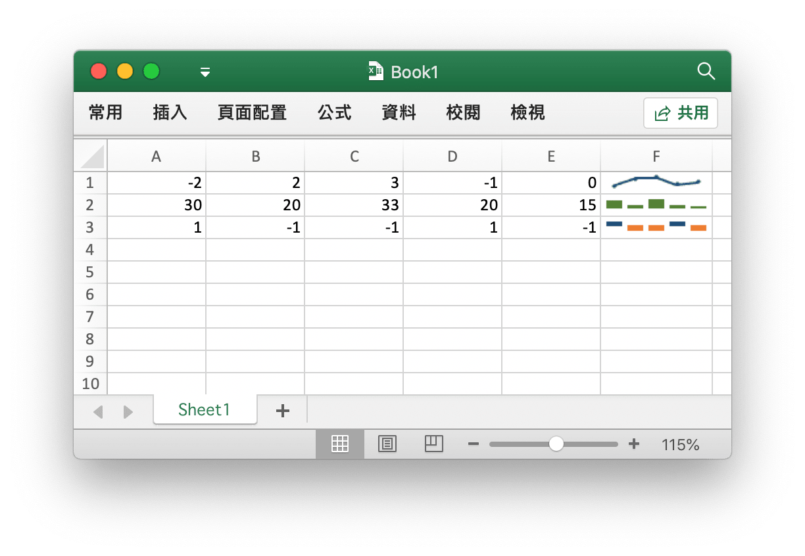
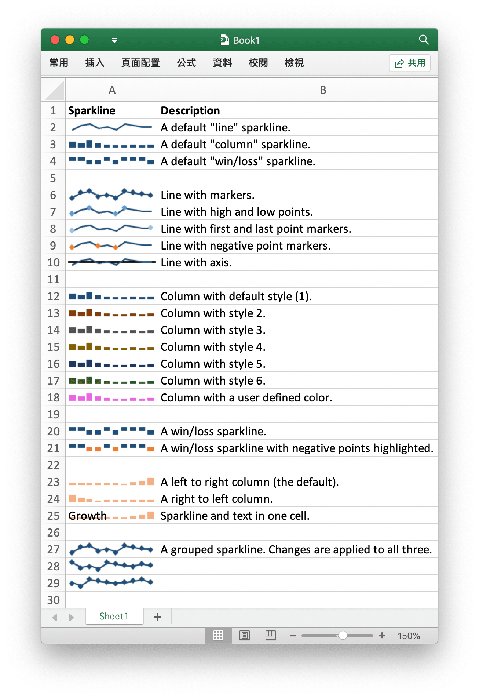

# 走勢圖

走勢圖是 Excel 2010 及以上版本中的功能，是放入儲存格中的小型圖，每個走勢圖代表所選內容中的一行資料。將走勢圖放在其資料附近可提供非常好的視覺衝擊。

<p align="center"></p>

[走勢圖](https://en.wikipedia.org/wiki/Sparklines) 是由 [Edward Tufte](https://en.wikipedia.org/wiki/Edward_Tufte) 發明的。

## 添加走勢圖

```go
func (f *File) AddSparkline(sheet string, opts *SparklineOptions) error
```

根據給定的工作表名和走勢圖屬性添加走勢圖。走勢圖是工作表儲存格中直觀表示資料的微型圖表。使用走勢圖以一系列值顯示趨勢（如季節性增加或減少、經濟週期），或醒目提示最大值和最小值。走勢圖在 Excel 2007 中將不會顯示。例如在工作表中添加一組走勢圖：

```go
err := f.AddSparkline("Sheet1", &excelize.SparklineOptions{
    Location: []string{"A1", "A2", "A3"},
    Range:    []string{"Sheet2!A1:J1", "Sheet2!A2:J2", "Sheet2!A3:J3"},
    Markers:  true,
})
```

<p align="center"></p>

下表為 Excelize 支持的走勢圖格式選項：

參數 | 描述
---|---
Location    | 必須參數, 數目需要與 `Range` 保持一致
Range       | 必須參數, 數目需要與 `Location` 保持一致
Type        | 枚舉值: `line`, `column`, `win_loss`
Style       | 用於設定走勢圖內建樣式，數值範圍: 0 - 35
Hight       | 用於設定是否顯示走勢圖高點：醒目提示所選走勢圖組中資料的最高點
Low         | 用於設定是否顯示走勢圖低點：醒目提示所選走勢圖組中資料的最低點
First       | 用於設定是否顯示走勢圖首點：醒目提示所選走勢圖組中資料的第一點
Last        | 用於設定是否顯示走勢圖尾點：醒目提示所選走勢圖組中資料的最後一點
Negative    | 用於設定是否顯示走勢圖負點：醒目提示所選走勢圖組中資料的負值
Markers     | 用於設定是否顯示走勢圖標記：醒目提示所選走勢圖組中資料的每個點
Axis        | 用於設定是否顯示走勢圖橫坐標軸
Reverse     | 用於設定橫坐標軸是否使用「從右到左的繪圖數據」
SeriesColor | 用於設定走勢圖色彩，形如 `RRGGBB` 格式的 RGB 十六進制色值代碼
