
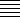
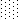

# 樣式

Alignment 映射儲存格對齊樣式設定。

```go
type Alignment struct {
    Horizontal      string `json:"horizontal"`
    Indent          int    `json:"indent"`
    JustifyLastLine bool   `json:"justify_last_line"`
    ReadingOrder    uint64 `json:"reading_order"`
    RelativeIndent  int    `json:"relative_indent"`
    ShrinkToFit     bool   `json:"shrink_to_fit"`
    TextRotation    int    `json:"text_rotation"`
    Vertical        string `json:"vertical"`
    WrapText        bool   `json:"wrap_text"`
}
```

Border 映射儲存格外框樣式設定。

```go
type Border struct {
    Type  string `json:"type"`
    Color string `json:"color"`
    Style int    `json:"style"`
}
```

Font 映射字體樣式設定。

```go
type Font struct {
    Bold      bool    `json:"bold"`
    Italic    bool    `json:"italic"`
    Underline string  `json:"underline"`
    Family    string  `json:"family"`
    Size      float64 `json:"size"`
    Strike    bool    `json:"strike"`
    Color     string  `json:"color"`
    VertAlign string `json:"vertAlign"`
}
```

Fill 映射儲存格樣式填充設定。

```go
type Fill struct {
    Type    string   `json:"type"`
    Pattern int      `json:"pattern"`
    Color   []string `json:"color"`
    Shading int      `json:"shading"`
}
```

Protection 映射保護儲存格屬性設定。

```go
type Protection struct {
    Hidden bool `json:"hidden"`
    Locked bool `json:"locked"`
}
```

Style 映射儲存格樣式設定。

```go
type Style struct {
    Border        []Border    `json:"border"`
    Fill          Fill        `json:"fill"`
    Font          *Font       `json:"font"`
    Alignment     *Alignment  `json:"alignment"`
    Protection    *Protection `json:"protection"`
    NumFmt        int         `json:"number_format"`
    DecimalPlaces int         `json:"decimal_places"`
    CustomNumFmt  *string     `json:"custom_number_format"`
    Lang          string      `json:"lang"`
    NegRed        bool        `json:"negred"`
}
```

## 創建樣式 {#NewStyle}

```go
func (f *File) NewStyle(style interface{}) (int, error)
```

通過給定的樣式格式結構體的指針或 JSON 創建樣式並傳回樣式索引。此功能是併發安全的。請注意，色彩需要使用 RGB 色域代碼表示。

### 外框 {#border}

下面的表格是 Excelize 中 `Border.Type` 支持的框線類型：

類型|說明|類型|說明
---|---|---|---
left|左側外框|top|頂部外框
right|右側外框|bottom|底部外框
diagonalDown|對角線向下|diagonalUp|對角線向上

下面的表格是 Excelize 中 `Border.Style` 支持的外框線型索引與對應的線型名稱、粗細及預覽效果：

索引|線型名稱|粗細|預覽效果
---|---|---|---
0|無|0|
1|連續線|1|
2|連續線|2|
3|短線|1|
4|點線|1|
5|連續線|3|
6|雙線|3|
7|連續線|0|
8|短線|2|
9|短線與點間隔線|1|
10|短線與點間隔線|2|
11|短線與兩個點一組重復線|1|
12|短線與兩個點一組重復線|2|
13|斜線與點線|2|

Excelize 中的 `Border.Style` 外框線型索引與 Office Excel 應用程式「設定儲存格格式」 - 「外框」對話框中的關係對照：

索引|預覽效果|索引|預覽效果
---|---|---|---
0||12|
7||13|
4||10|
11||8|
9||2|
3||5|
1||6|

### 色彩填滿 {#shading}

下面的表格是 Excelize 中儲存格色彩填滿樣式和索引 `Fill.Shading` 參數的關係對照：

索引|樣式|索引|樣式
---|---|---|---
0|橫向|3|對角線向下
1|直向|4|從對角線向內
2|對角線向上|5|從中心向外

### 圖案填滿 {#pattern}

下面的表格是 Excelize 中儲存格圖案填滿樣式和索引 `Fill.Pattern` 參數的關係對照：

索引|樣式|索引|樣式
---|---|---|---
0|無|10|
1||11|
2||12|
3||13|
4||14|
5||15|
6||16|
7||17|
8||18|
9|||

### 對齊方式 {#align}

#### 水平對齊方式

下面的表格是 Excelize 中儲存格水平對齊方式 `Alignment.Horizontal` 參數與樣式關係對照表：

參數|樣式
---|---
left|向左（縮進）
center|置中
right|靠右（縮進）
fill|填滿
justify|兩端對齊
centerContinuous|跨欄置中
distributed|分散對齊（縮進）

#### 垂直對齊方式

下面的表格是 Excelize 中儲存格垂直對齊方式 `Alignment.Vertical` 參數與樣式關係對照表：

參數|樣式
---|---
top|頂端對齊
center|置中
justify|兩端對齊
distributed|分散對齊

### 字型下划線 {#underline}

下面的表格是 Excelize 中儲存格字型下划線 `Font.Underline` 參數與樣式關係對照表：

參數|樣式
---|---
single|單線
double|雙線

### 數字自定義格式 {#number_format}

下面的表格是 Excelize 中支持的索引 `Style.NumFmt` 參數與數字自定義格式類別對照表：

索引|類別
---|---
0|`General`
1|`0`
2|`0.00`
3|`#,##0`
4|`#,##0.00`
5|`($#,##0_);($#,##0)`
6|`($#,##0_);[Red]($#,##0)`
7|`($#,##0.00_);($#,##0.00)`
8|`($#,##0.00_);[Red]($#,##0.00)`
9|`0%`
10|`0.00%`
11|`0.00E+00`
12|`# ?/?`
13|`# ??/??`
14|`m/d/yy`
15|`d-mmm-yy`
16|`d-mmm`
17|`mmm-yy`
18|`h:mm AM/PM`
19|`h:mm:ss AM/PM`
20|`h:mm`
21|`h:mm:ss`
22|`m/d/yy h:mm`
...|`...`
37|`(#,##0_);(#,##0)`
38|`(#,##0_);[Red](#,##0)`
39|`(#,##0.00_);(#,##0.00)`
40|`(#,##0.00_);[Red](#,##0.00)`
41|`_(* #,##0_);_(* (#,##0);_(* "-"_);_(@_)`
42|`_($* #,##0_);_($* (#,##0);_($* "-"_);_(@_)`
43|`_(* #,##0.00_);_(* (#,##0.00);_(* "-"??_);_(@_)`
44|`_($* #,##0.00_);_($* (#,##0.00);_($* "-"??_);_(@_)`
45|`mm:ss`
46|`[h]:mm:ss`
47|`mm:ss.0`
48|`##0.0E+0`
49|`@`

#### 繁體中文數字自定義格式

下面的表格是 Excelize 中支持的索引 `Style.NumFmt` 參數與繁體中文 `zh-tw` 版本數字自定義格式類別對照表：

索引|類別
---|---
27|`[$-404]e/m/d`
28|`[$-404]e"年"m"月"d"日"`
29|`[$-404]e"年"m"月"d"日"`
30|`m/d/yy`
31|`yyyy"年"m"月"d"日"`
32|`hh"時"mm"分"`
33|`hh"時"mm"分"ss"秒"`
34|`上午/下午 hh"時"mm"分"`
35|`上午/下午 hh"時"mm"分"ss"秒"`
36|`[$-404]e/m/d`
50|`[$-404]e/m/d`
51|`[$-404]e"年"m"月"d"日"`
52|`上午/下午 hh"時"mm"分"`
53|`上午/下午 hh"時"mm"分"ss"秒"`
54|`[$-404]e"年"m"月"d"日"`
55|`上午/下午 hh"時"mm"分"`
56|`上午/下午 hh"時"mm"分"ss"秒"`
57|`[$-404]e/m/d`
58|`[$-404]e"年"m"月"d"日"`

#### 簡體中文數字自定義格式

下面的表格是 Excelize 中支持的索引 `Style.NumFmt` 參數與簡體中文 `zh-cn` 版本數字自定義格式類別對照表：

索引|類別
---|---
27|`yyyy"年"m"月"`
28|`m"月"d"日"`
29|`m"月"d"日"`
30|`m-d-yy`
31|`yyyy"年"m"月"d"日"`
32|`h"時"mm"分"`
33|`h"時"mm"分"ss"秒"`
34|`上午/下午 h"時"mm"分"`
35|`上午/下午 h"時"mm"分"ss"秒`
36|`yyyy"年"m"月`
50|`yyyy"年"m"月`
51|`m"月"d"日`
52|`yyyy"年"m"月`
53|`m"月"d"日`
54|`m"月"d"日`
55|`上午/下午 h"時"mm"分`
56|`上午/下午 h"時"mm"分"ss"秒`
57|`yyyy"年"m"月`
58|`m"月"d"日"`

#### Unicode 繁體中文字型數字自定義格式

下面的表格是 Excelize 中支持的索引 `Style.NumFmt` 參數與 Unicode 繁體中文字型 `zh-tw` 版本數字自定義格式類別對照表：

索引|類別
---|---
27|`[$-404]e/m/`
28|`[$-404]e"5E74"m"6708"d"65E5`
29|`[$-404]e"5E74"m"6708"d"65E5`
30|`m/d/y`
31|`yyyy"5E74"m"6708"d"65E5`
32|`hh"6642"mm"5206`
33|`hh"6642"mm"5206"ss"79D2`
34|`4E0A5348/4E0B5348hh"6642"mm"5206`
35|`4E0A5348/4E0B5348hh"6642"mm"5206"ss"79D2`
36|`[$-404]e/m/`
50|`[$-404]e/m/`
51|`[$-404]e"5E74"m"6708"d"65E5`
52|`4E0A5348/4E0B5348hh"6642"mm"5206`
53|`4E0A5348/4E0B5348hh"6642"mm"5206"ss"79D2`
54|`[$-404]e"5E74"m"6708"d"65E5`
55|`4E0A5348/4E0B5348hh"6642"mm"5206`
56|`4E0A5348/4E0B5348hh"6642"mm"5206"ss"79D2`
57|`[$-404]e/m/`
58|`[$-404]e"5E74"m"6708"d"65E5"`

#### Unicode 簡體中文字型數字自定義格式

下面的表格是 Excelize 中支持的索引 `Style.NumFmt` 參數與 Unicode 簡體中文字型 `zh-cn` 版本數字自定義格式類別對照表：

索引|類別
---|---
27|`yyyy"5E74"m"6708`
28|`m"6708"d"65E5`
29|`m"6708"d"65E5`
30|`m-d-y`
31|`yyyy"5E74"m"6708"d"65E5`
32|`h"65F6"mm"5206`
33|`h"65F6"mm"5206"ss"79D2`
34|`4E0A5348/4E0B5348h"65F6"mm"5206`
35|`4E0A5348/4E0B5348h"65F6"mm"5206"ss"79D2`
36|`yyyy"5E74"m"6708`
50|`yyyy"5E74"m"6708`
51|`m"6708"d"65E5`
52|`yyyy"5E74"m"6708`
53|`m"6708"d"65E5`
54|`m"6708"d"65E5`
55|`4E0A5348/4E0B5348h"65F6"mm"5206`
56|`4E0A5348/4E0B5348h"65F6"mm"5206"ss"79D2`
57|`yyyy"5E74"m"6708`
58|`m"6708"d"65E5"`

#### 日本語數字自定義格式

下面的表格是 Excelize 中支持的索引 `Style.NumFmt` 參數與日本語 `ja-jp` 版本數字自定義格式類別對照表：

索引|類別
---|---
27|`[$-411]ge.m.d`
28|`[$-411]ggge"年"m"月"d"日`
29|`[$-411]ggge"年"m"月"d"日`
30|`m/d/y`
31|`yyyy"年"m"月"d"日`
32|`h"時"mm"分`
33|`h"時"mm"分"ss"秒`
34|`yyyy"年"m"月`
35|`m"月"d"日`
36|`[$-411]ge.m.d`
50|`[$-411]ge.m.d`
51|`[$-411]ggge"年"m"月"d"日`
52|`yyyy"年"m"月`
53|`m"月"d"日`
54|`[$-411]ggge"年"m"月"d"日`
55|`yyyy"年"m"月`
56|`m"月"d"日`
57|`[$-411]ge.m.d`
58|`[$-411]ggge"年"m"月"d"日"`

#### 韓語數字自定義格式

下面的表格是 Excelize 中支持的索引 `Style.NumFmt` 參數與韓語 `ko-kr` 版本數字自定義格式類別對照表：

索引|類別
---|---
27|`yyyy"年" mm"月" dd"日`
28|`mm-d`
29|`mm-d`
30|`mm-dd-y`
31|`yyyy"년" mm"월" dd"일`
32|`h"시" mm"분`
33|`h"시" mm"분" ss"초`
34|`yyyy-mm-d`
35|`yyyy-mm-d`
36|`yyyy"年" mm"月" dd"日`
50|`yyyy"年" mm"月" dd"日`
51|`mm-d`
52|`yyyy-mm-d`
53|`yyyy-mm-d`
54|`mm-d`
55|`yyyy-mm-d`
56|`yyyy-mm-d`
57|`yyyy"年" mm"月" dd"日`
58|`mm-dd`

#### Unicode 日本語字型數字自定義格式

下面的表格是 Excelize 中支持的索引 `Style.NumFmt` 參數與 Unicode 日本語字型 `ja-jp` 版本數字自定義格式類別對照表：

索引|類別
---|---
27|`[$-411]ge.m.d`
28|`[$-411]ggge"5E74"m"6708"d"65E5`
29|`[$-411]ggge"5E74"m"6708"d"65E5`
30|`m/d/y`
31|`yyyy"5E74"m"6708"d"65E5`
32|`h"6642"mm"5206`
33|`h"6642"mm"5206"ss"79D2`
34|`yyyy"5E74"m"6708`
35|`m"6708"d"65E5`
36|`[$-411]ge.m.d`
50|`[$-411]ge.m.d`
51|`[$-411]ggge"5E74"m"6708"d"65E5`
52|`yyyy"5E74"m"6708`
53|`m"6708"d"65E5`
54|`[$-411]ggge"5E74"m"6708"d"65E5`
55|`yyyy"5E74"m"6708`
56|`m"6708"d"65E5`
57|`[$-411]ge.m.d`
58|`[$-411]ggge"5E74"m"6708"d"65E5"`

#### Unicode 韓語字型數字自定義格式

下面的表格是 Excelize 中支持的索引 `Style.NumFmt` 參數與 Unicode 韓語字型 `ko-kr` 版本數字自定義格式類別對照表：

索引|類別
---|---
27|`yyyy"5E74" mm"6708" dd"65E5`
28|`mm-d`
29|`mm-d`
30|`mm-dd-y`
31|`yyyy"B144" mm"C6D4" dd"C77C`
32|`h"C2DC" mm"BD84`
33|`h"C2DC" mm"BD84" ss"CD08`
34|`yyyy-mm-d`
35|`yyyy-mm-d`
36|`yyyy"5E74" mm"6708" dd"65E5`
50|`yyyy"5E74" mm"6708" dd"65E5`
51|`mm-d`
52|`yyyy-mm-d`
53|`yyyy-mm-d`
54|`mm-d`
55|`yyyy-mm-d`
56|`yyyy-mm-d`
57|`yyyy"5E74" mm"6708" dd"65E5`
58|`mm-dd`

#### 泰國語數字自定義格式

下面的表格是 Excelize 中支持的索引 `Style.NumFmt` 參數與泰國語 `th-th` 版本數字自定義格式類別對照表：

索引|類別
---|---
59|`t`
60|`t0.0`
61|`t#,##`
62|`t#,##0.0`
67|`t0`
68|`t0.00`
69|`t# ?/`
70|`t# ??/?`
71|`ว/ด/ปปป`
72|`ว-ดดด-ป`
73|`ว-ดด`
74|`ดดด-ป`
75|`ช:น`
76|`ช:นน:ท`
77|`ว/ด/ปปปป ช:น`
78|`นน:ท`
79|`[ช]:นน:ท`
80|`นน:ทท.`
81|`d/m/bb`

#### Unicode 泰國語型數字自定義格式

下面的表格是 Excelize 中支持的索引 `Style.NumFmt` 參數與 Unicode 泰國語字型 `th-th` 版本數字自定義格式類別對照表：

索引|類別
---|---
59|`t`
60|`t0.0`
61|`t#,##`
62|`t#,##0.0`
67|`t0`
68|`t0.00`
69|`t# ?/`
70|`t# ??/?`
71|`0E27/0E14/0E1B0E1B0E1B0E1`
72|`0E27-0E140E140E14-0E1B0E1`
73|`0E27-0E140E140E1`
74|`0E140E140E14-0E1B0E1`
75|`0E0A:0E190E1`
76|`0E0A:0E190E19:0E170E1`
77|`0E27/0E14/0E1B0E1B0E1B0E1B 0E0A:0E190E1`
78|`0E190E19:0E170E1`
79|`[0E0A]:0E190E19:0E170E1`
80|`0E190E19:0E170E17.`
81|`d/m/bb`

### 貨幣格式

Excelize 目前支持的貨幣格式索引如下表所示，索引號僅用於標記，不在 Office Excel 檔案中使用，目前無法通過函數 [`GetCellValue`](cell.md#GetCellValue) 獲取格式化值後的值。

索引|貨幣格式
---|---
164|`CN¥`
165|`$ English (China)`
166|`$ Cherokee (United States)`
167|`$ Chinese (Singapore)`
168|`$ Chinese (Taiwan)`
169|`$ English (Australia)`
170|`$ English (Belize)`
171|`$ English (Canada)`
172|`$ English (Jamaica)`
173|`$ English (New Zealand)`
174|`$ English (Singapore)`
175|`$ English (Trinidad & Tobago)`
176|`$ English (U.S. Vigin Islands)`
177|`$ English (United States)`
178|`$ French (Canada)`
179|`$ Hawaiian (United States)`
180|`$ Malay (Brunei)`
181|`$ Quechua (Ecuador)`
182|`$ Spanish (Chile)`
183|`$ Spanish (Colombia)`
184|`$ Spanish (Ecuador)`
185|`$ Spanish (El Salvador)`
186|`$ Spanish (Mexico)`
187|`$ Spanish (Puerto Rico)`
188|`$ Spanish (United States)`
189|`$ Spanish (Uruguay)`
190|`£ English (United Kingdom)`
191|`£ Scottish Gaelic (United Kingdom)`
192|`£ Welsh (United Kindom)`
193|`¥ Chinese (China)`
194|`¥ Japanese (Japan)`
195|`¥ Sichuan Yi (China)`
196|`¥ Tibetan (China)`
197|`¥ Uyghur (China)`
198|`֏ Armenian (Armenia)`
199|`؋ Pashto (Afghanistan)`
200|`؋ Persian (Afghanistan)`
201|`৳ Bengali (Bangladesh)`
202|`៛ Khmer (Cambodia)`
203|`₡ Spanish (Costa Rica)`
204|`₦ Hausa (Nigeria)`
205|`₦ Igbo (Nigeria)`
206|`₦ Yoruba (Nigeria)`
207|`₩ Korean (South Korea)`
208|`₪ Hebrew (Israel)`
209|`₫ Vietnamese (Vietnam)`
210|`€ Basque (Spain)`
211|`€ Breton (France)`
212|`€ Catalan (Spain)`
213|`€ Corsican (France)`
214|`€ Dutch (Belgium)`
215|`€ Dutch (Netherlands)`
216|`€ English (Ireland)`
217|`€ Estonian (Estonia)`
218|`€ Euro (€ 123)`
219|`€ Euro (123 €)`
220|`€ Finnish (Finland)`
221|`€ French (Belgium)`
222|`€ French (France)`
223|`€ French (Luxembourg)`
224|`€ French (Monaco)`
225|`€ French (Réunion)`
226|`€ Galician (Spain)`
227|`€ German (Austria)`
228|`€ German (Luxembourg)`
229|`€ Greek (Greece)`
230|`€ Inari Sami (Finland)`
231|`€ Irish (Ireland)`
232|`€ Italian (Italy)`
233|`€ Latin (Italy)`
234|`€ Latin, Serbian (Montenegro)`
235|`€ Larvian (Latvia)`
236|`€ Lithuanian (Lithuania)`
237|`€ Lower Sorbian (Germany)`
238|`€ Luxembourgish (Luxembourg)`
239|`€ Maltese (Malta)`
240|`€ Northern Sami (Finland)`
241|`€ Occitan (France)`
242|`€ Portuguese (Portugal)`
243|`€ Serbian (Montenegro)`
244|`€ Skolt Sami (Finland)`
245|`€ Slovak (Slovakia)`
246|`€ Slovenian (Slovenia)`
247|`€ Spanish (Spain)`
248|`€ Swedish (Finland)`
249|`€ Swiss German (France)`
250|`€ Upper Sorbian (Germany)`
251|`€ Western Frisian (Netherlands)`
252|`₭ Lao (Laos)`
253|`₮ Mongolian (Mongolia)`
254|`₮ Mongolian, Mongolian (Mongolia)`
255|`₱ English (Philippines)`
256|`₱ Filipino (Philippines)`
257|`₴ Ukrainian (Ukraine)`
258|`₸ Kazakh (Kazakhstan)`
259|`₹ Arabic, Kashmiri (India)`
260|`₹ English (India)`
261|`₹ Gujarati (India)`
262|`₹ Hindi (India)`
263|`₹ Kannada (India)`
264|`₹ Kashmiri (India)`
265|`₹ Konkani (India)`
266|`₹ Manipuri (India)`
267|`₹ Marathi (India)`
268|`₹ Nepali (India)`
269|`₹ Oriya (India)`
270|`₹ Punjabi (India)`
271|`₹ Sanskrit (India)`
272|`₹ Sindhi (India)`
273|`₹ Tamil (India)`
274|`₹ Urdu (India)`
275|`₺ Turkish (Turkey)`
276|`₼ Azerbaijani (Azerbaijan)`
277|`₼ Cyrillic, Azerbaijani (Azerbaijan)`
278|`₽ Russian (Russia)`
279|`₽ Sakha (Russia)`
280|`₾ Georgian (Georgia)`
281|`B/. Spanish (Panama)`
282|`Br Oromo (Ethiopia)`
283|`Br Somali (Ethiopia)`
284|`Br Tigrinya (Ethiopia)`
285|`Bs Quechua (Bolivia)`
286|`Bs Spanish (Bolivia)`
287|`BS. Spanish (Venezuela)`
288|`BWP Tswana (Botswana)`
289|`C$ Spanish (Nicaragua)`
290|`CA$ Latin, Inuktitut (Canada)`
291|`CA$ Mohawk (Canada)`
292|`CA$ Unified Canadian Aboriginal Syllabics, Inuktitut (Canada)`
293|`CFA French (Mali)`
294|`CFA French (Senegal)`
295|`CFA Fulah (Senegal)`
296|`CFA Wolof (Senegal)`
297|`CHF French (Switzerland)`
298|`CHF German (Liechtenstein)`
299|`CHF German (Switzerland)`
300|`CHF Italian (Switzerland)`
301|`CHF Romansh (Switzerland)`
302|`CLP Mapuche (Chile)`
303|`CN¥ Mongolian, Mongolian (China)`
304|`DZD Central Atlas Tamazight (Algeria)`
305|`FCFA French (Cameroon)`
306|`Ft Hungarian (Hungary)`
307|`G French (Haiti)`
308|`Gs. Spanish (Paraguay)`
309|`GTQ K'iche' (Guatemala)`
310|`HK$ Chinese (Hong Kong (China))`
311|`HK$ English (Hong Kong (China))`
312|`HRK Croatian (Croatia)`
313|`IDR English (Indonesia)`
314|`IQD Arbic, Central Kurdish (Iraq)`
315|`ISK Icelandic (Iceland)`
316|`K Burmese (Myanmar (Burma))`
317|`Kč Czech (Czech Republic)`
318|`KM Bosnian (Bosnia & Herzegovina)`
319|`KM Croatian (Bosnia & Herzegovina)`
320|`KM Latin, Serbian (Bosnia & Herzegovina)`
321|`kr Faroese (Faroe Islands)`
322|`kr Northern Sami (Norway)`
323|`kr Northern Sami (Sweden)`
324|`kr Norwegian Bokmål (Norway)`
325|`kr Norwegian Nynorsk (Norway)`
326|`kr Swedish (Sweden)`
327|`kr. Danish (Denmark)`
328|`kr. Kalaallisut (Greenland)`
329|`Ksh Swahili (kenya)`
330|`L Romanian (Moldova)`
331|`L Russian (Moldova)`
332|`L Spanish (Honduras)`
333|`Lekë Albanian (Albania)`
334|`MAD Arabic, Central Atlas Tamazight (Morocco)`
335|`MAD French (Morocco)`
336|`MAD Tifinagh, Central Atlas Tamazight (Morocco)`
337|`MOP$ Chinese (Macau (China))`
338|`MVR Divehi (Maldives)`
339|`Nfk Tigrinya (Eritrea)`
340|`NGN Bini (Nigeria)`
341|`NGN Fulah (Nigeria)`
342|`NGN Ibibio (Nigeria)`
343|`NGN Kanuri (Nigeria)`
344|`NOK Lule Sami (Norway)`
345|`NOK Southern Sami (Norway)`
346|`NZ$ Maori (New Zealand)`
347|`PKR Sindhi (Pakistan)`
348|`PYG Guarani (Paraguay)`
349|`Q Spanish (Guatemala)`
350|`R Afrikaans (South Africa)`
351|`R English (South Africa)`
352|`R Zulu (South Africa)`
353|`R$ Portuguese (Brazil)`
354|`RD$ Spanish (Dominican Republic)`
355|`RF Kinyarwanda (Rwanda)`
356|`RM English (Malaysia)`
357|`RM Malay (Malaysia)`
358|`RON Romanian (Romania)`
359|`Rp Indonesoan (Indonesia)`
360|`Rs Urdu (Pakistan)`
361|`Rs. Tamil (Sri Lanka)`
362|`RSD Latin, Serbian (Serbia)`
363|`RSD Serbian (Serbia)`
364|`RUB Bashkir (Russia)`
365|`RUB Tatar (Russia)`
366|`S/. Quechua (Peru)`
367|`S/. Spanish (Peru)`
368|`SEK Lule Sami (Sweden)`
369|`SEK Southern Sami (Sweden)`
370|`soʻm Latin, Uzbek (Uzbekistan)`
371|`soʻm Uzbek (Uzbekistan)`
372|`SYP Syriac (Syria)`
373|`THB Thai (Thailand)`
374|`TMT Turkmen (Turkmenistan)`
375|`US$ English (Zimbabwe)`
376|`ZAR Northern Sotho (South Africa)`
377|`ZAR Southern Sotho (South Africa)`
378|`ZAR Tsonga (South Africa)`
379|`ZAR Tswana (south Africa)`
380|`ZAR Venda (South Africa)`
381|`ZAR Xhosa (South Africa)`
382|`zł Polish (Poland)`
383|`ден Macedonian (Macedonia)`
384|`KM Cyrillic, Bosnian (Bosnia & Herzegovina)`
385|`KM Serbian (Bosnia & Herzegovina)`
386|`лв. Bulgarian (Bulgaria)`
387|`p. Belarusian (Belarus)`
388|`сом Kyrgyz (Kyrgyzstan)`
389|`сом Tajik (Tajikistan)`
390|`ج.م. Arabic (Egypt)`
391|`د.أ. Arabic (Jordan)`
392|`د.أ. Arabic (United Arab Emirates)`
393|`د.ب. Arabic (Bahrain)`
394|`د.ت. Arabic (Tunisia)`
395|`د.ج. Arabic (Algeria)`
396|`د.ع. Arabic (Iraq)`
397|`د.ك. Arabic (Kuwait)`
398|`د.ل. Arabic (Libya)`
399|`د.م. Arabic (Morocco)`
400|`ر Punjabi (Pakistan)`
401|`ر.س. Arabic (Saudi Arabia)`
402|`ر.ع. Arabic (Oman)`
403|`ر.ق. Arabic (Qatar)`
404|`ر.ي. Arabic (Yemen)`
405|`ریال Persian (Iran)`
406|`ل.س. Arabic (Syria)`
407|`ل.ل. Arabic (Lebanon)`
408|`ብር Amharic (Ethiopia)`
409|`रू Nepaol (Nepal)`
410|`රු. Sinhala (Sri Lanka)`
411|`ADP`
412|`AED`
413|`AFA`
414|`AFN`
415|`ALL`
416|`AMD`
417|`ANG`
418|`AOA`
419|`ARS`
420|`ATS`
421|`AUD`
422|`AWG`
423|`AZM`
424|`AZN`
425|`BAM`
426|`BBD`
427|`BDT`
428|`BEF`
429|`BGL`
430|`BGN`
431|`BHD`
432|`BIF`
433|`BMD`
434|`BND`
435|`BOB`
436|`BOV`
437|`BRL`
438|`BSD`
439|`BTN`
440|`BWP`
441|`BYR`
442|`BZD`
443|`CAD`
444|`CDF`
445|`CHE`
446|`CHF`
447|`CHW`
448|`CLF`
449|`CLP`
450|`CNY`
451|`COP`
452|`COU`
453|`CRC`
454|`CSD`
455|`CUC`
456|`CVE`
457|`CYP`
458|`CZK`
459|`DEM`
460|`DJF`
461|`DKK`
462|`DOP`
463|`DZD`
464|`ECS`
465|`ECV`
466|`EEK`
467|`EGP`
468|`ERN`
469|`ESP`
470|`ETB`
471|`EUR`
472|`FIM`
473|`FJD`
474|`FKP`
475|`FRF`
476|`GBP`
477|`GEL`
478|`GHC`
479|`GHS`
480|`GIP`
481|`GMD`
482|`GNF`
483|`GRD`
484|`GTQ`
485|`GYD`
486|`HKD`
487|`HNL`
488|`HRK`
489|`HTG`
490|`HUF`
491|`IDR`
492|`IEP`
493|`ILS`
494|`INR`
495|`IQD`
496|`IRR`
497|`ISK`
498|`ITL`
499|`JMD`
500|`JOD`
501|`JPY`
502|`KAF`
503|`KES`
504|`KGS`
505|`KHR`
506|`KMF`
507|`KPW`
508|`KRW`
509|`KWD`
510|`KYD`
511|`KZT`
512|`LAK`
513|`LBP`
514|`LKR`
515|`LRD`
516|`LSL`
517|`LTL`
518|`LUF`
519|`LVL`
520|`LYD`
521|`MAD`
522|`MDL`
523|`MGA`
524|`MGF`
525|`MKD`
526|`MMK`
527|`MNT`
528|`MOP`
529|`MRO`
530|`MTL`
531|`MUR`
532|`MVR`
533|`MWK`
534|`MXN`
535|`MXV`
536|`MYR`
537|`MZM`
538|`MZN`
539|`NAD`
540|`NGN`
541|`NIO`
542|`NLG`
543|`NOK`
544|`NPR`
545|`NTD`
546|`NZD`
547|`OMR`
548|`PAB`
549|`PEN`
550|`PGK`
551|`PHP`
552|`PKR`
553|`PLN`
554|`PTE`
555|`PYG`
556|`QAR`
557|`ROL`
558|`RON`
559|`RSD`
560|`RUB`
561|`RUR`
562|`RWF`
563|`SAR`
564|`SBD`
565|`SCR`
566|`SDD`
567|`SDG`
568|`SDP`
569|`SEK`
570|`SGD`
571|`SHP`
572|`SIT`
573|`SKK`
574|`SLL`
575|`SOS`
576|`SPL`
577|`SRD`
578|`SRG`
579|`STD`
580|`SVC`
581|`SYP`
582|`SZL`
583|`THB`
584|`TJR`
585|`TJS`
586|`TMM`
587|`TMT`
588|`TND`
589|`TOP`
590|`TRL`
591|`TRY`
592|`TTD`
593|`TWD`
594|`TZS`
595|`UAH`
596|`UGX`
597|`USD`
598|`USN`
599|`USS`
600|`UYI`
601|`UYU`
602|`UZS`
603|`VEB`
604|`VEF`
605|`VND`
606|`VUV`
607|`WST`
608|`XAF`
609|`XAG`
610|`XAU`
611|`XB5`
612|`XBA`
613|`XBB`
614|`XBC`
615|`XBD`
616|`XCD`
617|`XDR`
618|`XFO`
619|`XFU`
620|`XOF`
621|`XPD`
622|`XPF`
623|`XPT`
624|`XTS`
625|`XXX`
626|`YER`
627|`YUM`
628|`ZAR`
629|`ZMK`
630|`ZMW`
631|`ZWD`
632|`ZWL`
633|`ZWN`
634|`ZWR`

Excelize 支持為儲存格設定自定義數字格式。例如，將 `Sheet1` 工作表的 `A6` 儲存格 設定為烏拉圭（西班牙）格式的日期類別：

<p align="center"></p>

```go
f := excelize.NewFile()
f.SetCellValue("Sheet1", "A6", 42920.5)
exp := "[$-380A]dddd\\,\\ dd\" de \"mmmm\" de \"yyyy;@"
style, err := f.NewStyle(&excelize.Style{CustomNumFmt: &exp})
err = f.SetCellStyle("Sheet1", "A6", "A6", style)
```

儲存格 `Sheet1!A6` 在 Office Excel 應用程式中將會被格式化為：`martes, 04 de Julio de 2017`

## 設定欄樣式 {#SetColStyle}

```go
func (f *File) SetColStyle(sheet, columns string, styleID int) error
```

根據給定的工作表名稱、欄區域和樣式索引設定欄樣式。此功能是併發安全的。請注意，這將覆蓋欄的已有樣式，而不會將樣式與已有樣式疊加或合併。

例1，為名稱為 `Sheet1` 的工作表中的 `H` 欄設定樣式：

```go
err = f.SetColStyle("Sheet1", "H", style)
```

例2，為名稱為 `Sheet1` 的工作表中的 `C:F` 欄設定樣式：

```go
err = f.SetColStyle("Sheet1", "C:F", style)
```

## 獲取欄樣式 {#GetColStyle}

```go
func (f *File) GetColStyle(sheet, col string) (int, error)
```

根據給定的工作表名稱和欄名稱獲取欄的樣式索引。此功能是併發安全的。

## 設定列樣式 {#SetRowStyle}

根據給定的工作表名稱、列區域和樣式索引設定列樣式。請注意，這將覆蓋列的已有樣式，而不會將樣式與已有樣式疊加或合併。

例1，為名稱為 `Sheet1` 的工作表的第 1 列設定樣式:

```go
err = f.SetRowStyle("Sheet1", 1, 1, styleID)
```

例2，為名稱為 `Sheet1` 的工作表的第 1 至 10 列設定樣式:

```go
err = f.SetRowStyle("Sheet1", 1, 10, styleID)
```

## 設定默認字型 {#SetDefaultFont}

```go
func (f *File) SetDefaultFont(fontName string)
```

根據給定的字型名稱為活頁簿設定默認字型。

## 獲取默認字型 {#GetDefaultFont}

```go
func (f *File) GetDefaultFont() string
```

獲取當前活頁簿的默認字型名稱。通過 Excelize 創建的活頁簿默認字型為 Calibri。
