


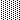

# 樣式

Alignment 映射儲存格對齊樣式設定。

```go
type Alignment struct {
    Horizontal      string
    Indent          int
    JustifyLastLine bool
    ReadingOrder    uint64
    RelativeIndent  int
    ShrinkToFit     bool
    TextRotation    int
    Vertical        string
    WrapText        bool
}
```

Border 映射儲存格外框樣式設定。

```go
type Border struct {
    Type  string
    Color string
    Style int
}
```

Font 映射字體樣式設定。

```go
type Font struct {
    Bold         bool
    Italic       bool
    Underline    string
    Family       string
    Size         float64
    Strike       bool
    Color        string
    ColorIndexed int
    ColorTheme   *int
    ColorTint    float64
    VertAlign    string
}
```

Fill 映射儲存格樣式填充設定。

```go
type Fill struct {
    Type    string
    Pattern int
    Color   []string
    Shading int
}
```

Protection 映射保護儲存格屬性設定。

```go
type Protection struct {
    Hidden bool
    Locked bool
}
```

Style 映射儲存格樣式設定。

```go
type Style struct {
    Border        []Border
    Fill          Fill
    Font          *Font
    Alignment     *Alignment
    Protection    *Protection
    NumFmt        int
    DecimalPlaces int
    CustomNumFmt  *string
    Lang          string
    NegRed        bool
}
```

## 創建樣式 {#NewStyle}

```go
func (f *File) NewStyle(style *Style) (int, error)
```

通過給定的樣式格式結構體的指針或 JSON 創建樣式並傳回樣式索引。此功能是併發安全的。請注意，`Font.Color` 需要使用 `RRGGBB` 格式的 RGB 十六進制色值代碼。

### 外框 {#border}

下面的表格是 Excelize 中 `Border.Type` 支持的框線類型：

類型|說明|類型|說明
---|---|---|---
left|左側外框|top|頂部外框
right|右側外框|bottom|底部外框
diagonalDown|對角線向下|diagonalUp|對角線向上

下面的表格是 Excelize 中 `Border.Style` 支持的外框線型索引與對應的線型名稱、粗細及預覽效果：

索引|線型名稱|粗細|預覽效果
---|---|---|---
0|無|0|
1|連續線|1|
2|連續線|2|
3|短線|1|
4|點線|1|
5|連續線|3|
6|雙線|3|
7|連續線|0|
8|短線|2|
9|短線與點間隔線|1|
10|短線與點間隔線|2|
11|短線與兩個點一組重復線|1|
12|短線與兩個點一組重復線|2|
13|斜線與點線|2|

Excelize 中的 `Border.Style` 外框線型索引與 Office Excel 應用程式「設定儲存格格式」 - 「外框」對話框中的關係對照：

索引|預覽效果|索引|預覽效果
---|---|---|---
0||12|
7||13|
4||10|
11||8|
9||2|
3||5|
1||6|

### 色彩填滿 {#shading}

下面的表格是 Excelize 中儲存格色彩填滿樣式和索引 `Fill.Shading` 參數的關係對照：

索引|樣式|索引|樣式
---|---|---|---
0|橫向|3|對角線向下
1|直向|4|從對角線向內
2|對角線向上|5|從中心向外

### 圖案填滿 {#pattern}

下面的表格是 Excelize 中儲存格圖案填滿樣式和索引 `Fill.Pattern` 參數的關係對照：

索引|樣式|索引|樣式
---|---|---|---
0|無|10|
1||11|
2||12|
3||13|
4||14|
5||15|
6||16|
7||17|
8||18|
9|||

### 對齊方式 {#align}

#### 水平對齊方式

下面的表格是 Excelize 中儲存格水平對齊方式 `Alignment.Horizontal` 參數與樣式關係對照表：

參數|樣式
---|---
left|向左（縮進）
center|置中
right|靠右（縮進）
fill|填滿
justify|兩端對齊
centerContinuous|跨欄置中
distributed|分散對齊（縮進）

#### 垂直對齊方式

下面的表格是 Excelize 中儲存格垂直對齊方式 `Alignment.Vertical` 參數與樣式關係對照表：

參數|樣式
---|---
top|頂端對齊
center|置中
justify|兩端對齊
distributed|分散對齊

### 字型下划線 {#underline}

下面的表格是 Excelize 中儲存格字型下划線 `Font.Underline` 參數與樣式關係對照表：

參數|樣式
---|---
single|單線
double|雙線

### 數字自定義格式 {#number_format}

下面的表格是 Excelize 中支持的索引 `Style.NumFmt` 參數與數字自定義格式類別對照表：

索引|類別
---|---
0|`General`
1|`0`
2|`0.00`
3|`#,##0`
4|`#,##0.00`
5|`($#,##0_);($#,##0)`
6|`($#,##0_);[Red]($#,##0)`
7|`($#,##0.00_);($#,##0.00)`
8|`($#,##0.00_);[Red]($#,##0.00)`
9|`0%`
10|`0.00%`
11|`0.00E+00`
12|`# ?/?`
13|`# ??/??`
14|`m/d/yy`
15|`d-mmm-yy`
16|`d-mmm`
17|`mmm-yy`
18|`h:mm AM/PM`
19|`h:mm:ss AM/PM`
20|`h:mm`
21|`h:mm:ss`
22|`m/d/yy h:mm`
...|`...`
37|`(#,##0_);(#,##0)`
38|`(#,##0_);[Red](#,##0)`
39|`(#,##0.00_);(#,##0.00)`
40|`(#,##0.00_);[Red](#,##0.00)`
41|`_(* #,##0_);_(* (#,##0);_(* "-"_);_(@_)`
42|`_($* #,##0_);_($* (#,##0);_($* "-"_);_(@_)`
43|`_(* #,##0.00_);_(* (#,##0.00);_(* "-"??_);_(@_)`
44|`_($* #,##0.00_);_($* (#,##0.00);_($* "-"??_);_(@_)`
45|`mm:ss`
46|`[h]:mm:ss`
47|`mm:ss.0`
48|`##0.0E+0`
49|`@`

#### 繁體中文數字自定義格式

下面的表格是 Excelize 中支持的索引 `Style.NumFmt` 參數與繁體中文 `zh-tw` 版本數字自定義格式類別對照表：

索引|類別
---|---
27|`[$-404]e/m/d`
28|`[$-404]e"年"m"月"d"日"`
29|`[$-404]e"年"m"月"d"日"`
30|`m/d/yy`
31|`yyyy"年"m"月"d"日"`
32|`hh"時"mm"分"`
33|`hh"時"mm"分"ss"秒"`
34|`上午/下午 hh"時"mm"分"`
35|`上午/下午 hh"時"mm"分"ss"秒"`
36|`[$-404]e/m/d`
50|`[$-404]e/m/d`
51|`[$-404]e"年"m"月"d"日"`
52|`上午/下午 hh"時"mm"分"`
53|`上午/下午 hh"時"mm"分"ss"秒"`
54|`[$-404]e"年"m"月"d"日"`
55|`上午/下午 hh"時"mm"分"`
56|`上午/下午 hh"時"mm"分"ss"秒"`
57|`[$-404]e/m/d`
58|`[$-404]e"年"m"月"d"日"`

#### 簡體中文數字自定義格式

下面的表格是 Excelize 中支持的索引 `Style.NumFmt` 參數與簡體中文 `zh-cn` 版本數字自定義格式類別對照表：

索引|類別
---|---
27|`yyyy"年"m"月"`
28|`m"月"d"日"`
29|`m"月"d"日"`
30|`m-d-yy`
31|`yyyy"年"m"月"d"日"`
32|`h"時"mm"分"`
33|`h"時"mm"分"ss"秒"`
34|`上午/下午 h"時"mm"分"`
35|`上午/下午 h"時"mm"分"ss"秒`
36|`yyyy"年"m"月`
50|`yyyy"年"m"月`
51|`m"月"d"日`
52|`yyyy"年"m"月`
53|`m"月"d"日`
54|`m"月"d"日`
55|`上午/下午 h"時"mm"分`
56|`上午/下午 h"時"mm"分"ss"秒`
57|`yyyy"年"m"月`
58|`m"月"d"日"`

#### Unicode 繁體中文字型數字自定義格式

下面的表格是 Excelize 中支持的索引 `Style.NumFmt` 參數與 Unicode 繁體中文字型 `zh-tw` 版本數字自定義格式類別對照表：

索引|類別
---|---
27|`[$-404]e/m/`
28|`[$-404]e"5E74"m"6708"d"65E5`
29|`[$-404]e"5E74"m"6708"d"65E5`
30|`m/d/y`
31|`yyyy"5E74"m"6708"d"65E5`
32|`hh"6642"mm"5206`
33|`hh"6642"mm"5206"ss"79D2`
34|`4E0A5348/4E0B5348hh"6642"mm"5206`
35|`4E0A5348/4E0B5348hh"6642"mm"5206"ss"79D2`
36|`[$-404]e/m/`
50|`[$-404]e/m/`
51|`[$-404]e"5E74"m"6708"d"65E5`
52|`4E0A5348/4E0B5348hh"6642"mm"5206`
53|`4E0A5348/4E0B5348hh"6642"mm"5206"ss"79D2`
54|`[$-404]e"5E74"m"6708"d"65E5`
55|`4E0A5348/4E0B5348hh"6642"mm"5206`
56|`4E0A5348/4E0B5348hh"6642"mm"5206"ss"79D2`
57|`[$-404]e/m/`
58|`[$-404]e"5E74"m"6708"d"65E5"`

#### Unicode 簡體中文字型數字自定義格式

下面的表格是 Excelize 中支持的索引 `Style.NumFmt` 參數與 Unicode 簡體中文字型 `zh-cn` 版本數字自定義格式類別對照表：

索引|類別
---|---
27|`yyyy"5E74"m"6708`
28|`m"6708"d"65E5`
29|`m"6708"d"65E5`
30|`m-d-y`
31|`yyyy"5E74"m"6708"d"65E5`
32|`h"65F6"mm"5206`
33|`h"65F6"mm"5206"ss"79D2`
34|`4E0A5348/4E0B5348h"65F6"mm"5206`
35|`4E0A5348/4E0B5348h"65F6"mm"5206"ss"79D2`
36|`yyyy"5E74"m"6708`
50|`yyyy"5E74"m"6708`
51|`m"6708"d"65E5`
52|`yyyy"5E74"m"6708`
53|`m"6708"d"65E5`
54|`m"6708"d"65E5`
55|`4E0A5348/4E0B5348h"65F6"mm"5206`
56|`4E0A5348/4E0B5348h"65F6"mm"5206"ss"79D2`
57|`yyyy"5E74"m"6708`
58|`m"6708"d"65E5"`

#### 日本語數字自定義格式

下面的表格是 Excelize 中支持的索引 `Style.NumFmt` 參數與日本語 `ja-jp` 版本數字自定義格式類別對照表：

索引|類別
---|---
27|`[$-411]ge.m.d`
28|`[$-411]ggge"年"m"月"d"日`
29|`[$-411]ggge"年"m"月"d"日`
30|`m/d/y`
31|`yyyy"年"m"月"d"日`
32|`h"時"mm"分`
33|`h"時"mm"分"ss"秒`
34|`yyyy"年"m"月`
35|`m"月"d"日`
36|`[$-411]ge.m.d`
50|`[$-411]ge.m.d`
51|`[$-411]ggge"年"m"月"d"日`
52|`yyyy"年"m"月`
53|`m"月"d"日`
54|`[$-411]ggge"年"m"月"d"日`
55|`yyyy"年"m"月`
56|`m"月"d"日`
57|`[$-411]ge.m.d`
58|`[$-411]ggge"年"m"月"d"日"`

#### 韓語數字自定義格式

下面的表格是 Excelize 中支持的索引 `Style.NumFmt` 參數與韓語 `ko-kr` 版本數字自定義格式類別對照表：

索引|類別
---|---
27|`yyyy"年" mm"月" dd"日`
28|`mm-d`
29|`mm-d`
30|`mm-dd-y`
31|`yyyy"년" mm"월" dd"일`
32|`h"시" mm"분`
33|`h"시" mm"분" ss"초`
34|`yyyy-mm-d`
35|`yyyy-mm-d`
36|`yyyy"年" mm"月" dd"日`
50|`yyyy"年" mm"月" dd"日`
51|`mm-d`
52|`yyyy-mm-d`
53|`yyyy-mm-d`
54|`mm-d`
55|`yyyy-mm-d`
56|`yyyy-mm-d`
57|`yyyy"年" mm"月" dd"日`
58|`mm-dd`

#### Unicode 日本語字型數字自定義格式

下面的表格是 Excelize 中支持的索引 `Style.NumFmt` 參數與 Unicode 日本語字型 `ja-jp` 版本數字自定義格式類別對照表：

索引|類別
---|---
27|`[$-411]ge.m.d`
28|`[$-411]ggge"5E74"m"6708"d"65E5`
29|`[$-411]ggge"5E74"m"6708"d"65E5`
30|`m/d/y`
31|`yyyy"5E74"m"6708"d"65E5`
32|`h"6642"mm"5206`
33|`h"6642"mm"5206"ss"79D2`
34|`yyyy"5E74"m"6708`
35|`m"6708"d"65E5`
36|`[$-411]ge.m.d`
50|`[$-411]ge.m.d`
51|`[$-411]ggge"5E74"m"6708"d"65E5`
52|`yyyy"5E74"m"6708`
53|`m"6708"d"65E5`
54|`[$-411]ggge"5E74"m"6708"d"65E5`
55|`yyyy"5E74"m"6708`
56|`m"6708"d"65E5`
57|`[$-411]ge.m.d`
58|`[$-411]ggge"5E74"m"6708"d"65E5"`

#### Unicode 韓語字型數字自定義格式

下面的表格是 Excelize 中支持的索引 `Style.NumFmt` 參數與 Unicode 韓語字型 `ko-kr` 版本數字自定義格式類別對照表：

索引|類別
---|---
27|`yyyy"5E74" mm"6708" dd"65E5`
28|`mm-d`
29|`mm-d`
30|`mm-dd-y`
31|`yyyy"B144" mm"C6D4" dd"C77C`
32|`h"C2DC" mm"BD84`
33|`h"C2DC" mm"BD84" ss"CD08`
34|`yyyy-mm-d`
35|`yyyy-mm-d`
36|`yyyy"5E74" mm"6708" dd"65E5`
50|`yyyy"5E74" mm"6708" dd"65E5`
51|`mm-d`
52|`yyyy-mm-d`
53|`yyyy-mm-d`
54|`mm-d`
55|`yyyy-mm-d`
56|`yyyy-mm-d`
57|`yyyy"5E74" mm"6708" dd"65E5`
58|`mm-dd`

#### 泰國語數字自定義格式

下面的表格是 Excelize 中支持的索引 `Style.NumFmt` 參數與泰國語 `th-th` 版本數字自定義格式類別對照表：

索引|類別
---|---
59|`t`
60|`t0.0`
61|`t#,##`
62|`t#,##0.0`
67|`t0`
68|`t0.00`
69|`t# ?/`
70|`t# ??/?`
71|`ว/ด/ปปป`
72|`ว-ดดด-ป`
73|`ว-ดด`
74|`ดดด-ป`
75|`ช:น`
76|`ช:นน:ท`
77|`ว/ด/ปปปป ช:น`
78|`นน:ท`
79|`[ช]:นน:ท`
80|`นน:ทท.`
81|`d/m/bb`

#### Unicode 泰國語型數字自定義格式

下面的表格是 Excelize 中支持的索引 `Style.NumFmt` 參數與 Unicode 泰國語字型 `th-th` 版本數字自定義格式類別對照表：

索引|類別
---|---
59|`t`
60|`t0.0`
61|`t#,##`
62|`t#,##0.0`
67|`t0`
68|`t0.00`
69|`t# ?/`
70|`t# ??/?`
71|`0E27/0E14/0E1B0E1B0E1B0E1`
72|`0E27-0E140E140E14-0E1B0E1`
73|`0E27-0E140E140E1`
74|`0E140E140E14-0E1B0E1`
75|`0E0A:0E190E1`
76|`0E0A:0E190E19:0E170E1`
77|`0E27/0E14/0E1B0E1B0E1B0E1B 0E0A:0E190E1`
78|`0E190E19:0E170E1`
79|`[0E0A]:0E190E19:0E170E1`
80|`0E190E19:0E170E17.`
81|`d/m/bb`

### 貨幣格式

Excelize 目前支持的貨幣格式索引如下表所示，索引號僅用於標記，不在 Office Excel 檔案中使用，目前無法通過函數 [`GetCellValue`](cell.md#GetCellValue) 獲取格式化值後的值。

索引|貨幣格式
---|---
164|¥
165|$ 英語（美國）
166|$ 切羅基語（切羅基，美國）
167|$ 中文（簡體，新加坡）
168|$ 中文（繁體，中國台灣）
169|$ 英語（澳大利亞）
170|$ 英語（伯利茲）
171|$ 英語（加拿大）
172|$ 英語（牙買加）
173|$ 英語（新西蘭）
174|$ 英語（新加坡）
175|$ 英語（特立尼達島和多巴哥）
176|$ 英語（加勒比海）
177|$ 中文（新加坡）
178|$ 法語（加拿大）
179|$ 夏威夷語
180|$ 馬來語（文萊達魯薩蘭國）
181|$ 克丘亞語（厄瓜多爾）
182|$ 西班牙語（智利）
183|$ 西班牙語（哥倫比亞）
184|$ 西班牙語（厄瓜多爾）
185|$ 西班牙語（薩爾瓦多）
186|$ 西班牙語（墨西哥）
187|$ 西班牙語（波多黎各）
188|$ 西班牙語（美國）
189|$ 西班牙語（烏拉圭）
190|£ 英語（英國）
191|£ 蘇格蘭蓋爾語（英國）
192|£ 威爾士語
193|¥ 中文（簡體，中國大陸）
194|¥ 日語
195|¥ 彝語（中國）
196|¥ 藏語（中國）
197|¥ 維吾爾語（中國）
198|֏ 亞美尼亞語
199|؋ 普什圖語
200|؋ 達里語
201|৳ 孟加拉語（孟加拉）
202|៛ 高棉語
203|₡ 西班牙語（哥斯達黎加）
204|₦ 豪撒語
205|₦ 伊博語
206|₩ 朝鮮語
207|₪ 希伯來語
208|₫ 越南語
209|€ 巴斯克語
210|€ 布列塔尼語
211|€ 加泰羅尼亞語
212|€ 科西嘉語
213|€ 荷蘭語（比利時）
214|€ 荷蘭語（荷蘭）
215|€ 英語（愛爾蘭）
216|€ 愛沙尼亞語
217|€ 歐元(€123)
218|€ 歐元(123€)
219|€ 芬蘭語
220|€ 法語（比利時）
221|€ 法語（法國）
222|€ 法語（盧森堡）
223|€ 法語（摩納哥）
224|€ 法語（留尼旺島）
225|€ 加利西亞語
226|€ 德語（奧地利）
227|€ 德語（德國）
228|€ 德語（盧森堡）
229|€ 希臘語
230|€ 伊那裡薩米語（芬蘭）
231|€ 愛爾蘭語
232|€ 意大利語（意大利）
233|€ 英語（愛爾蘭）
234|€ 塞爾維亞語（拉丁語，黑山）
235|€ 拉脫維亞語
236|€ 立陶宛語
237|€ 下索布語
238|€ 盧森堡語
239|€ 馬耳他語
240|€ 北薩米語（芬蘭）
241|€ 奧克西唐語
242|€ 葡萄牙語（葡萄牙）
243|€ 塞爾維亞語（西里爾文，黑山）
244|€ 斯科特薩米語（芬蘭）
245|€ 斯洛伐克語
246|€ 斯洛文尼亞語
247|€ 西班牙語（西班牙）
248|€ 瑞典語（芬蘭）
249|€ 阿爾薩斯語（法國）
250|€ 上索布語
251|€ 西弗里西亞語
252|₭ 老撾語
253|₮ 蒙古語（蒙古）
254|₮ 蒙古語（蒙古）
255|₱ 英語（菲律賓）
256|₱ 菲律賓語
257|₴ 烏克蘭語
258|₸ 哈薩克語
259|₹ 克什米爾語（阿拉伯文）
260|₹ 英語（印度）
261|₹ 古吉拉特語
262|₹ 印地語
263|₹ 埃納德語
264|₹ 克什米爾語
265|₹ 孔卡尼語
266|₹ 曼尼普爾語
267|₹ 馬拉地語
268|₹ 尼泊爾語（印度）
269|₹ 奧里亞語
270|₹ 旁遮普語（印度）
271|₹ 梵語
272|₹ 信德語（梵文）
273|₹ 泰米爾語（印度）
274|₹ 烏爾都語（印度）
275|₺ 土耳其語（土耳其）
276|₼ 阿塞拜疆語（拉丁語）
277|₼ 阿塞拜疆語（西里爾文）
278|₽ 俄語
279|₽ 薩哈語
280|₾ 格魯吉亞語
281|B/. 西班牙語（巴拿馬）
282|Br 奧羅莫語
283|Br 白俄羅斯語
284|Br 白俄羅斯語
285|Bs 克丘亞語（玻利維亞）
286|Bs 西班牙語（玻利維亞）
287|BS. 克丘亞語（玻利維亞）
288|BWP 茨瓦納語（博茨瓦納）
289|C$ 西班牙語（尼加拉瓜）
290|CA$ 因紐特語（拉丁語，加拿大）
291|CA$ 莫霍克語（加拿大）
292|CA$ 因紐特語（加拿大）
293|CFA 法語（馬里）
294|CFA 法語（塞內加爾）
295|CFA 富拉語（塞內加爾）
296|CFA 沃洛夫語（塞內加爾）
297|CHF 法語（瑞士）
298|CHF 德語（列支敦士登）
299|CHF 標準德語（瑞士）
300|CHF 意大利語（瑞士）
301|CHF 羅曼什語
302|CLP 馬普切語（智利）
303|CN¥ 蒙古語（中國）
304|DZD 中阿特斯柏柏爾語（拉丁文，阿爾及利亞）
305|FCFA 法語（喀麥隆）
306|Ft 匈牙利語
307|G 法語（海地）
308|Gs. 西班牙語（巴拉圭）
309|GTQ 基切語
310|HK$ 中文（繁體，香港特別行政區）
311|HK$ 英語（香港特別行政區）
312|HRK 克羅地亞語（克羅地亞）
313|IDR 英語（印度尼西亞）
314|IQD 阿拉伯語、中庫爾德語（伊拉克）
315|ISK 冰島語
316|K 緬甸語
317|Kč 捷克語
318|KM 波斯尼亞語（拉丁語）
319|KM 克羅地亞語（波斯尼亞和黑塞哥維那）
320|KM 塞爾維亞語（拉丁語，波斯尼亞和黑塞哥維那）
321|Kr 法羅語
322|Kr 北薩米語（挪威）
323|kr 北薩米語（瑞典）
324|Kr 挪威語（博克馬爾語）
325|Kr 挪威語（尼諾斯克語）
326|kr瑞典語（瑞典）
327|kr.丹麥語
328|kr.格陵蘭語
329|Ksh 斯瓦希里語
330|L 羅馬尼亞語（摩爾多瓦）
331|L 俄語（摩爾多瓦）
332|L 西班牙語（洪都拉斯）
333|Lekë 阿爾巴尼亞語
334|MAD 中阿特拉斯柏柏爾語（提夫納語，摩洛哥）
335|MAD 法語（摩洛哥）
336|MAD 中阿特拉斯柏柏爾語（提夫納語，摩洛哥）
337|MOP$ 中文（繁體，澳門特別行政區）
338|MVR 迪維希語（馬爾代夫）
339|Nfk 提格里尼亞語（厄立特里亞省）
340|NGN 克瓦語（埃多人說的克瓦語）
341|NGN 富拉（尼日利亞）
342|NGN 伊比比奧語（尼日利亞）
343|NGN 卡努里語
344|NOK 律勒歐薩米語（挪威）
345|NOK 南薩米語（挪威）
346|NZ$ 毛利語（新西蘭）
347|PKR 信德語（巴基斯坦）
348|PYG 瓜拉尼語（巴拉圭）
349|Q 西班牙語（危地馬拉）
350|R 南非荷蘭語
351|R 英語（南非）
352|R 祖魯語
353|R$ 葡萄牙語（巴西）
354|RD$ 西班牙語（多米尼加共和國）
355|RF 盧旺達語
356|RM 英語（馬來西亞）
357|RM 馬來語（馬來西亞）
358|RON 羅馬尼亞語
359|Rp 印度尼西亞語
360|Rs 烏爾都語（巴基斯坦）
361|Rs. 泰米爾語（斯里蘭卡）
362|RSD 塞爾維亞語（拉丁語，塞爾維亞和黑山（前））
363|RSD 塞爾維亞語（西里爾文，塞爾維亞和黑山（前））
364|RUB 巴什基爾語（俄羅斯）
365|RUB 韃靼語（俄羅斯）
366|S/. 蓋丘亞語（秘魯）
367|S/. 西班牙語（秘魯）
368|SEK 律勒歐薩米語（瑞典）
369|SEK 南薩米語（瑞典）
370|soʻm 烏茲別克語（拉丁語）
371|soʻm 烏茲別克語（拉丁語）
372|SYP 敘利亞語（敘利亞）
373|THB 泰語（泰國）
374|TMT 土庫曼語
375|US$ 英語（津巴布韋）
376|ZAR 北索托語（南非）
377|ZAR 南索托語（南非）
378|ZAR 特松加語（南非）
379|ZAR 茨瓦納語（南非）
380|ZAR 文達語（南非）
381|ZAR 科薩語（南非）
382|zł 波蘭語
383|ден 馬其頓語（馬其頓）
384|KM 波斯尼亞語（西里爾文）
385|KM 塞爾維亞語（西里爾文、波斯尼亞和黑塞哥維那）
386|лв. 保加利亞語
387|p. 白俄羅斯語（白俄羅斯）
388|сом 吉爾吉斯語
389|сом 吉爾吉斯語
390|ج.م. 阿拉伯語（埃及）
391|د.أ. 阿拉伯語（約旦）
392|د.أ. 阿拉伯語（阿拉伯聯合酋長國）
393|د.ب. 阿拉伯語（巴林）
394|د.ت. 阿拉伯語（突尼斯）
395|د.ج. 阿拉伯語（阿爾及利亞）
396|د.ع. 阿拉伯語（伊拉克）
397|د.ك. 阿拉伯語（科威特）
398|د.ل. 阿拉伯語（利比亞）
399|د.م. 阿拉伯語（摩洛哥）
400|ر 旁遮普語（巴基斯坦）
401|ر.س. 阿拉伯語（沙特阿拉伯）
402|ر.ع. 阿拉伯語（阿曼）
403|ر.ق. 阿拉伯語（卡塔爾）
404|ر.ي. 阿拉伯語（也門）
405|ریال 波斯語（伊朗）
406|ل.س. 阿拉伯語（敘利亞）
407|ل.ل. 阿拉伯語（黎巴嫩）
408|ብር 阿姆哈拉語
409|रू 尼泊爾語
410|රු. 僧伽羅語
411|ADP
412|AED
413|AFA
414|AFN
415|ALL
416|AMD
417|ANG
418|AOA
419|ARS
420|ATS
421|AUD
422|AWG
423|AZM
424|AZN
425|BAM
426|BBD
427|BDT
428|BEF
429|BGL
430|BGN
431|BHD
432|BIF
433|BMD
434|BND
435|BOB
436|BOV
437|BRL
438|BSD
439|BTN
440|BWP
441|BYR
442|BZD
443|CAD
444|CDF
445|CHE
446|CHF
447|CHW
448|CLF
449|CLP
450|CNY
451|COP
452|COU
453|CRC
454|CSD
455|CUC
456|CVE
457|CYP
458|CZK
459|DEM
460|DJF
461|DKK
462|DOP
463|DZD
464|ECS
465|ECV
466|EEK
467|EGP
468|ERN
469|ESP
470|ETB
471|EUR
472|FIM
473|FJD
474|FKP
475|FRF
476|GBP
477|GEL
478|GHC
479|GHS
480|GIP
481|GMD
482|GNF
483|GRD
484|GTQ
485|GYD
486|HKD
487|HNL
488|HRK
489|HTG
490|HUF
491|IDR
492|IEP
493|ILS
494|INR
495|IQD
496|IRR
497|ISK
498|ITL
499|JMD
500|JOD
501|JPY
502|KAF
503|KES
504|KGS
505|KHR
506|KMF
507|KPW
508|KRW
509|KWD
510|KYD
511|KZT
512|LAK
513|LBP
514|LKR
515|LRD
516|LSL
517|LTL
518|LUF
519|LVL
520|LYD
521|MAD
522|MDL
523|MGA
524|MGF
525|MKD
526|MMK
527|MNT
528|MOP
529|MRO
530|MTL
531|MUR
532|MVR
533|MWK
534|MXN
535|MXV
536|MYR
537|MZM
538|MZN
539|NAD
540|NGN
541|NIO
542|NLG
543|NOK
544|NPR
545|NTD
546|NZD
547|OMR
548|PAB
549|PEN
550|PGK
551|PHP
552|PKR
553|PLN
554|PTE
555|PYG
556|QAR
557|ROL
558|RON
559|RSD
560|RUB
561|RUR
562|RWF
563|SAR
564|SBD
565|SCR
566|SDD
567|SDG
568|SDP
569|SEK
570|SGD
571|SHP
572|SIT
573|SKK
574|SLL
575|SOS
576|SPL
577|SRD
578|SRG
579|STD
580|SVC
581|SYP
582|SZL
583|THB
584|TJR
585|TJS
586|TMM
587|TMT
588|TND
589|TOP
590|TRL
591|TRY
592|TTD
593|TWD
594|TZS
595|UAH
596|UGX
597|USD
598|USN
599|USS
600|UYI
601|UYU
602|UZS
603|VEB
604|VEF
605|VND
606|VUV
607|WST
608|XAF
609|XAG
610|XAU
611|XB5
612|XBA
613|XBB
614|XBC
615|XBD
616|XCD
617|XDR
618|XFO
619|XFU
620|XOF
621|XPD
622|XPF
623|XPT
624|XTS
625|XXX
626|YER
627|YUM
628|ZAR
629|ZMK
630|ZMW
631|ZWD
632|ZWL
633|ZWN
634|ZWR

Excelize 支持為儲存格設定自定義數字格式。例如，將 `Sheet1` 工作表的 `A6` 儲存格 設定為烏拉圭（西班牙）格式的日期類別：

<p align="center"></p>

```go
f := excelize.NewFile()
defer func() {
    if err := f.Close(); err != nil {
        fmt.Println(err)
    }
}()
if err := f.SetCellValue("Sheet1", "A6", 42920.5); err != nil {
    fmt.Println(err)
    return
}
exp := "[$-380A]dddd\\,\\ dd\" de \"mmmm\" de \"yyyy;@"
style, err := f.NewStyle(&excelize.Style{CustomNumFmt: &exp})
if err != nil {
    fmt.Println(err)
    return
}
err = f.SetCellStyle("Sheet1", "A6", "A6", style)
```

儲存格 `Sheet1!A6` 在 Office Excel 應用程式中將會被格式化為：`martes, 04 de Julio de 2017`

## 設定欄樣式 {#SetColStyle}

```go
func (f *File) SetColStyle(sheet, columns string, styleID int) error
```

根據給定的工作表名稱、欄區域和樣式索引設定欄樣式。此功能是併發安全的。請注意，這將覆蓋欄的已有樣式，而不會將樣式與已有樣式疊加或合併。

例1，為名稱為 `Sheet1` 的工作表中的 `H` 欄設定樣式：

```go
err = f.SetColStyle("Sheet1", "H", style)
```

例2，為名稱為 `Sheet1` 的工作表中的 `C:F` 欄設定樣式：

```go
err = f.SetColStyle("Sheet1", "C:F", style)
```

## 獲取欄樣式 {#GetColStyle}

```go
func (f *File) GetColStyle(sheet, col string) (int, error)
```

根據給定的工作表名稱和欄名稱獲取欄的樣式索引。此功能是併發安全的。

## 設定列樣式 {#SetRowStyle}

```go
func (f *File) SetRowStyle(sheet string, start, end, styleID int) error
```

根據給定的工作表名稱、列區域和樣式索引設定列樣式。請注意，這將覆蓋列的已有樣式，而不會將樣式與已有樣式疊加或合併。

例1，為名稱為 `Sheet1` 的工作表的第 1 列設定樣式:

```go
err := f.SetRowStyle("Sheet1", 1, 1, styleID)
```

例2，為名稱為 `Sheet1` 的工作表的第 1 至 10 列設定樣式:

```go
err := f.SetRowStyle("Sheet1", 1, 10, styleID)
```

## 設定默認字型 {#SetDefaultFont}

```go
func (f *File) SetDefaultFont(fontName string)
```

根據給定的字型名稱為活頁簿設定默認字型。

## 獲取默認字型 {#GetDefaultFont}

```go
func (f *File) GetDefaultFont() string
```

獲取當前活頁簿的默認字型名稱。通過 Excelize 創建的活頁簿默認字型為 Calibri。
