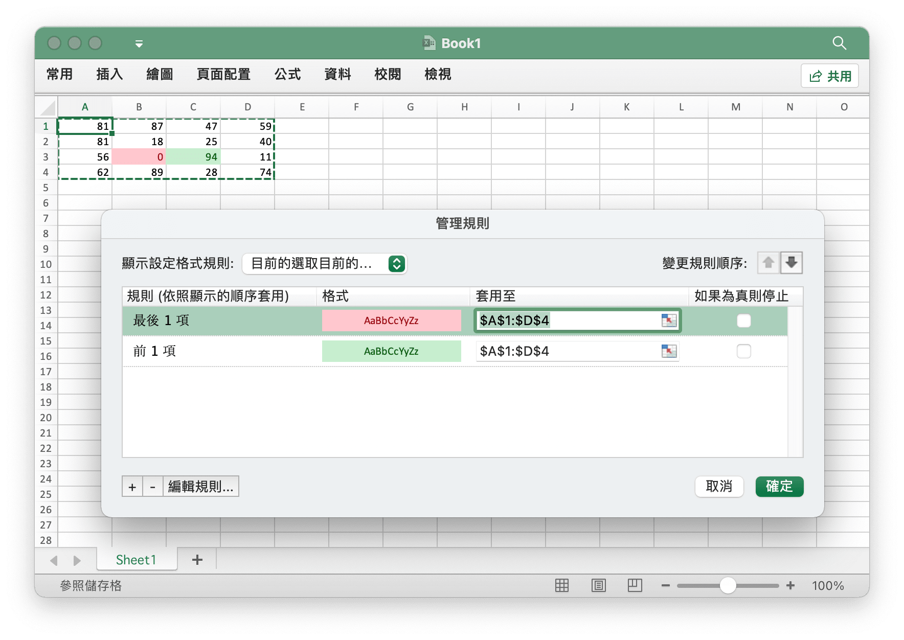

# 工具函式

## 創建表格 {#AddTable}

```go
func (f *File) AddTable(sheet string, table *Table) error
```

根據給定的工作表名、儲存格坐標區域和條件式格式創建表格。

- 例1，在名為 `Sheet1` 的工作表 `A1:D5` 區域創建表格：

<p align="center"></p>

```go
err := f.AddTable("Sheet1", &excelize.Table{Range: "A1:D5"})
```

- 例2，在名為 `Sheet2` 的工作表 `F2:H6` 區域創建帶有條件式格式的表格：

<p align="center"></p>

```go
disable := false
err := f.AddTable("Sheet2", &excelize.Table{
    Range:             "F2:H6",
    Name:              "table",
    StyleName:         "TableStyleMedium2",
    ShowFirstColumn:   true,
    ShowLastColumn:    true,
    ShowRowStripes:    &disable,
    ShowColumnStripes: true,
})
```

注意，表格坐標區域至少需要包含兩列：字符型的標題列和內容列。每欄標題列的字符需保證是唯一的，並且必須在調用 AddTable 函式前設定表格的標題列資料。多個表格的坐標區域不能有交集。

可選參數 `Name` 用以設定自定義表格名稱，同一個工作表內的表格名稱應該是唯一的。

Excelize 支持的表格樣式 `StyleName` 參數：

```text
TableStyleLight1 - TableStyleLight21
TableStyleMedium1 - TableStyleMedium28
TableStyleDark1 - TableStyleDark11
```

索引|預覽|索引|預覽|索引|預覽
---|---|---|---|---|---
||TableStyleLight1||TableStyleLight2|
TableStyleLight3||TableStyleLight4||TableStyleLight5|
TableStyleLight6||TableStyleLight7||TableStyleLight8|
TableStyleLight9||TableStyleLight10||TableStyleLight11|
TableStyleLight12||TableStyleLight13||TableStyleLight14|
TableStyleLight15||TableStyleLight16||TableStyleLight17|
TableStyleLight18||TableStyleLight19||TableStyleLight20|
TableStyleLight21||TableStyleMedium1||TableStyleMedium2|
TableStyleMedium3||TableStyleMedium4||TableStyleMedium5|
TableStyleMedium6||TableStyleMedium7||TableStyleMedium8|
TableStyleMedium9||TableStyleMedium10||TableStyleMedium11|
TableStyleMedium12||TableStyleMedium13||TableStyleMedium14|
TableStyleMedium15||TableStyleMedium16||TableStyleMedium17|
TableStyleMedium18||TableStyleMedium19||TableStyleMedium20|
TableStyleMedium21||TableStyleMedium22||TableStyleMedium23|
TableStyleMedium24||TableStyleMedium25||TableStyleMedium26|
TableStyleMedium27||TableStyleMedium28||TableStyleDark1|
TableStyleDark2||TableStyleDark3||TableStyleDark4|
TableStyleDark5||TableStyleDark6||TableStyleDark7|
TableStyleDark8||TableStyleDark9||TableStyleDark10|
TableStyleDark11|||||

## 獲取表格 {#GetTables}

```go
func (f *File) GetTables(sheet string) ([]Table, error)
```

根據給定的工作表名稱獲取指定工作表中的全部表格。

## 刪除表格 {#DeleteTable}

```go
func (f *File) DeleteTable(name string) error
```

根據給定的表格名稱刪除表格。

## 自動過濾器 {#AutoFilter}

```go
func (f *File) AutoFilter(sheet, rangeRef string, opts []AutoFilterOptions) error
```

根據給定的工作表名稱、儲存格坐標區域和條件式格式創建自動過濾器。电子表格中的自動過濾器可以對一些簡單的二維資料資料進列資料篩選。

例1，在名稱為 `Sheet1` 的工作表 `A1:D4` 區域創建自動過濾器：

<p align="center"></p>

```go
err := f.AutoFilter("Sheet1", "A1:D4", []excelize.AutoFilterOptions{})
```

例2，在名稱為 `Sheet1` 的工作表 `A1:D4` 區域創建帶有格式條件的自動過濾器：

```go
err := f.AutoFilter("Sheet1", "A1:D4", []excelize.AutoFilterOptions{
    {Column: "B", Expression: "x != blanks"},
})
```

參數 `Column` 指定了自動過濾器在過濾範圍內的基準欄。Excelize 暫不支持自動過濾器的計算，在設定過濾條件後，如果需要隱藏任何不符合過濾條件的列，可以使用 [`SetRowVisible()`](sheet.md#SetRowVisible) 設定列的可見性。

為欄設定過濾條件，參數 `Expression` 用於指定過濾條件運算，支持下列運算符：

```text
==
!=
>
<
>=
<=
and
or
```

一個表達式可以包含一個或兩個由 `and` 和 `or` 運算符分隔的語句。例如：

```text
x <  2000
x >  2000
x == 2000
x >  2000 and x <  5000
x == 2000 or  x == 5000
```

可以透過在表達式中使用空白或非空白值來實現空白或非空白資料的過濾：

```text
x == Blanks
x == NonBlanks
```

Office Excel 還允許一些簡單的字符串匹配操作：

```text
x == b*      // 以 b 開始
x != b*      // 不以 b 開始
x == *b      // 以 b 結尾
x != *b      // 不以 b 結尾
x == *b*     // 包含 b
x != *b*     // 不包含 b
```

我們還可以使用 `*` 來匹配任何字符或數字，用
`?` 匹配任何單個字符或數字。除此之外，Office Excel 的自動過濾器不支持其他正則表達式的關鍵字。Excel 的正則表達式字符可以使用 `~` 進行轉義。

上述示例中的佔位符變數 `x` 可以被任何簡單的字符串替換。實際的佔位符名稱在內部被忽略，所以以下所有表達式的效果都是等同的：

```text
x     < 2000
col   < 2000
Price < 2000
```

## 清除儲存格緩存 {#UpdateLinkedValue}

```go
func (f *File) UpdateLinkedValue() error
```

Excel 會在儲存時將儲存帶有公式的儲存格的計算結果，這會導致在 Office Excel 2007 和 2010 中文檔在開啓時，即便計算因子已經發生變化，公式的計算結果不會自動更新。參考鏈接：[https://social.technet.microsoft.com/Forums/office/en-US/e16bae1f-6a2c-4325-8013-e989a3479066/excel-2010-linked-cells-not-updating](https://social.technet.microsoft.com/Forums/office/en-US/e16bae1f-6a2c-4325-8013-e989a3479066/excel-2010-linked-cells-not-updating) 此函式會將活頁簿中所有緩存結果清除，這樣文檔在 Office Excel 中被重新開啓時會自動計算新的公式結果，但是由於計算後文檔發生了變化，在關閉文檔時 Office Excel 會提示是否儲存活頁簿。

清除儲存格緩存對活頁簿的影響表現為對 `<v>` 標籤的修改，例如，清除前的儲存格緩存：

```xml
<row r="19" spans="2:2">
    <c r="B19">
        <f>SUM(Sheet2!D2,Sheet2!D11)</f>
        <v>100</v>
     </c>
</row>
```

清除儲存格緩存後：

```xml
<row r="19" spans="2:2">
    <c r="B19">
        <f>SUM(Sheet2!D2,Sheet2!D11)</f>
    </c>
</row>
```

## 儲存格坐標切分 {#SplitCellName}

```go
func SplitCellName(cell string) (string, int, error)
```

將工作表的儲存格坐標切分為欄名和列號。例如，將儲存格坐標 `AK74` 切分為 `AK` 和 `74`：

```go
excelize.SplitCellName("AK74") // return "AK", 74, nil
```

## 儲存格坐標組合 {#JoinCellName}

```go
func JoinCellName(col string, row int) (string, error)
```

將欄名和列號組合成工作表的儲存格坐標。

## 欄名轉索引 {#ColumnNameToNumber}

```go
func ColumnNameToNumber(name string) (int, error)
```

將工作表的欄名（不區分大小寫）轉換為索引，對於錯誤的欄名格式將傳回錯誤。例如：

```go
excelize.ColumnNameToNumber("AK") // returns 37, nil
```

## 索引轉欄名 {#ColumnNumberToName}

```go
func ColumnNumberToName(num int) (string, error)
```

將資料類別為整型的索引轉換為欄名。例如：

```go
excelize.ColumnNumberToName(37) // returns "AK", nil
```

## 儲存格坐標轉索引 {#CellNameToCoordinates}

```go
func CellNameToCoordinates(cell string) (int, int, error)
```

將由字母和數字組合而成的儲存格坐標轉換為 `[X, Y]` 形式的列、欄索引，或傳回錯誤。例如：

```go
excelize.CellNameToCoordinates("A1") // returns 1, 1, nil
excelize.CellNameToCoordinates("Z3") // returns 26, 3, nil
```

## 索引轉儲存格坐標 {#CoordinatesToCellName}

```go
func CoordinatesToCellName(col, row int, abs ...bool) (string, error)
```

將 `[X, Y]` 形式的列、欄索引轉換為由字母和數字組合而成的儲存格坐標，或傳回錯誤。例如：

```go
excelize.CoordinatesToCellName(1, 1) // returns "A1", nil
excelize.CoordinatesToCellName(1, 1, true) // returns "$A$1", nil
```

## 創建條件式格式樣式 {#NewConditionalStyle}

```go
func (f *File) NewConditionalStyle(style *Style) (int, error)
```

透過給定樣式為條件式格式創建樣式，樣式參數與 [`NewStyle`](style.md#NewStyle) 函式的相同。請注意，使用 RGB 色域色彩代碼時，目前僅支持設定字型、填滿、對齊和外框的色彩。

## 獲取條件式格式樣式 {#GetConditionalStyle}

```go
func (f *File) GetConditionalStyle(idx int) (*Style, error)
```

根據給定的條件式格式樣式索引獲取條件式格式樣式定義。

## 設定條件式格式 {#SetConditionalFormat}

```go
func (f *File) SetConditionalFormat(sheet, rangeRef string, opts []ConditionalFormatOptions) error
```

根據給定的工作表名稱、儲存格坐標區域和格式參數，為儲存格值創建條件式格式設定規則。條件式格式是 Office Excel 的一項功能，它允許您根據特定條件將格式應用於儲存格或一系列儲存格。

格式參數 `Type` 選項是必需的參數，它沒有默認值。允許的類別值及其相關參數是：

<table>
    <thead>
        <tr>
            <th>類別</th>
            <th>參數</th>
        </tr>
    </thead>
    <tbody>
        <tr>
            <td rowspan=4>cell</td>
            <td>Criteria</td>
        </tr>
        <tr>
            <td>Value</td>
        </tr>
        <tr>
            <td>MinValue</td>
        </tr>
        <tr>
            <td>MaxValue</td>
        </tr>
        <tr>
            <td>time_period</td>
            <td>Criteria</td>
        </tr>
        <tr>
            <td rowspan=2>text</td>
            <td>Criteria</td>
        </tr>
        <tr>
            <td>Value</td>
        </tr>
        <tr>
            <td>average</td>
            <td>Criteria</td>
        </tr>
        <tr>
            <td>duplicate</td>
            <td>(none)</td>
        </tr>
        <tr>
            <td>unique</td>
            <td>(none)</td>
        </tr>
        <tr>
            <td rowspan=2>top</td>
            <td>Criteria</td>
        </tr>
        <tr>
            <td>Value</td>
        </tr>
        <tr>
            <td rowspan=2>bottom</td>
            <td>Criteria</td>
        </tr>
        <tr>
            <td>Value</td>
        </tr>
        <tr>
            <td>blanks</td>
            <td>(none)</td>
        </tr>
        <tr>
            <td>no_blanks</td>
            <td>(none)</td>
        </tr>
        <tr>
            <td>errors</td>
            <td>(none)</td>
        </tr>
        <tr>
            <td>no_errors</td>
            <td>(none)</td>
        </tr>
        <tr>
            <td rowspan=6>2_color_scale</td>
            <td>MinType</td>
        </tr>
        <tr>
            <td>MaxType</td>
        </tr>
        <tr>
            <td>MinValue</td>
        </tr>
        <tr>
            <td>MaxValue</td>
        </tr>
        <tr>
            <td>MinColor</td>
        </tr>
        <tr>
            <td>MaxColor</td>
        </tr>
        <tr>
            <td rowspan=9>3_color_scale</td>
            <td>MinType</td>
        </tr>
        <tr>
            <td>MidType</td>
        </tr>
        <tr>
            <td>MaxType</td>
        </tr>
        <tr>
            <td>MinValue</td>
        </tr>
        <tr>
            <td>MidValue</td>
        </tr>
        <tr>
            <td>MaxValue</td>
        </tr>
        <tr>
            <td>MinColor</td>
        </tr>
        <tr>
            <td>MidColor</td>
        </tr>
        <tr>
            <td>MaxColor</td>
        </tr>
        <tr>
            <td rowspan=9>data_bar</td>
            <td>MinType</td>
        </tr>
        <tr>
            <td>MaxType</td>
        </tr>
        <tr>
            <td>MinValue</td>
        </tr>
        <tr>
            <td>MaxValue</td>
        </tr>
        <tr>
            <td>BarBorderColor</td>
        </tr>
        <tr>
            <td>BarColor</td>
        </tr>
        <tr>
            <td>BarDirection</td>
        </tr>
        <tr>
            <td>BarOnly</td>
        </tr>
        <tr>
            <td>BarSolid</td>
        </tr>
        <tr>
            <td rowspan=3>iconSet</td>
            <td>IconStyle</td>
        </tr>
        <tr>
            <td>ReverseIcons</td>
        </tr>
        <tr>
            <td>IconsOnly</td>
        </tr>
        <tr>
            <td>formula</td>
            <td>Criteria</td>
        </tr>
    </tbody>
</table>

`Criteria` 參數用於設定儲存格資料的條件式格式運算符。它沒有默認值，同常與 `excelize.ConditionalFormatOptions{Type: "cell"}` 一起使用，支持的參數為：

文本描述字符|符號表示
---|---
between|
not between|
equal to|==
not equal to|!=
greater than|>
less than|<
greater than or equal to|>=
less than or equal to|<=

可以使用上面表格第一欄中的 Office Excel 文本描述字符，或者符號表示方法（`between` 與 `not between` 沒有符號表示法）作為條件式格式運算符。下面的相關部分顯示了其他條件式格式類別的特定標準。

`Value`：該值通常與 `Criteria` 參數一起使用，可以用確定的值作為設定儲存格條件式格式的條件參數：

```go
err := f.SetConditionalFormat("Sheet1", "D1:D10",
    []excelize.ConditionalFormatOptions{
        {
            Type:     "cell",
            Criteria: ">",
            Format:   format,
            Value:    "6",
        },
    },
)
```

`Value` 屬性也可以是儲存格引用：

```go
err := f.SetConditionalFormat("Sheet1", "D1:D10",
    []excelize.ConditionalFormatOptions{
        {
            Type:     "cell",
            Criteria: ">",
            Format:   format,
            Value:    "$C$1",
        },
    },
)
```

類別：`Format` - `Format` 參數用於指定滿足條件式格式標準時將應用於儲存格的格式。該參數可以透過 [`NewConditionalStyle()`](utils.md#NewConditionalStyle) 方法來創建：

```go
format, err := f.NewConditionalStyle(
    &excelize.Style{
        Font: &excelize.Font{Color: "9A0511"},
        Fill: excelize.Fill{
            Type: "pattern", Color: []string{"FEC7CE"}, Pattern: 1,
        },
    },
)
if err != nil {
    fmt.Println(err)
}
err = f.SetConditionalFormat("Sheet1", "D1:D10",
    []excelize.ConditionalFormatOptions{
        {Type: "cell", Criteria: ">", Format: format, Value: "6"},
    },
)
```

注意：在 Office Excel 中，條件式格式疊加在現有儲存格格式上，並非所有儲存格格式屬性都可以修改。無法在條件式格式中修改的屬性包括：字型名稱、字型大小、上標和下標、對角外框、所有對齊屬性和所有保護屬性。

Office Excel 中內置了一些與條件式格式一起使用的默認樣式。可以使用以下 excelize 設定實現這些樣式效果：

```go
// 淺紅填滿色深色文本代表較差
format1, err := f.NewConditionalStyle(
    &excelize.Style{
        Font: &excelize.Font{Color: "9A0511"},
        Fill: excelize.Fill{
            Type: "pattern", Color: []string{"FEC7CE"}, Pattern: 1,
        },
    },
)

// 黃填滿色深黃色文本代表一般
format2, err := f.NewConditionalStyle(
    &excelize.Style{
        Font: &excelize.Font{Color: "9B5713"},
        Fill: excelize.Fill{
            Type: "pattern", Color: []string{"FEEAA0"}, Pattern: 1,
        },
    },
)

// 綠填滿色深綠色文本代表較好
format3, err := f.NewConditionalStyle(
    &excelize.Style{
        Font: &excelize.Font{Color: "09600B"},
        Fill: excelize.Fill{
            Type: "pattern", Color: []string{"C7EECF"}, Pattern: 1,
        },
    },
)
```

類別：`MinValue` - 當條件式格式 `Criteria` 為 `between` 或 `not between` 時，`MinValue` 參數用於設定下限值。

```go
// 高亮儲存格條件式格式規則： between...
err := f.SetConditionalFormat("Sheet1", "A1:A10",
    []excelize.ConditionalFormatOptions{
        {
            Type:     "cell",
            Criteria: "between",
            Format:   format,
            MinValue: "6",
            MaxValue: "8",
        },
    },
)
```

類別：`MaxValue` - 當條件式格式 `Criteria` 為 `between` 或 `not between` 時，`MaxValue` 參數用於設定上限值，參考上面的例子。

類別：`average` - 平均類別用於指定 Office Excel 「前段後段規則」中「經典」樣式的「僅高於或低於平均值的數值設定格式」條件式格式：

```go
// 前段後段規則：高於平均值...
err := f.SetConditionalFormat("Sheet1", "A1:A10",
    []excelize.ConditionalFormatOptions{
        {
            Type:         "average",
            Criteria:     "=",
            Format:       format1,
            AboveAverage: true,
        },
    },
)

// 前段後段規則：低於平均值...
err := f.SetConditionalFormat("Sheet1", "B1:B10",
    []excelize.ConditionalFormatOptions{
        {
            Type:         "average",
            Criteria:     "=",
            Format:       format2,
            AboveAverage: false,
        },
    },
)
```

類別：`duplicate` - 用於設定「醒目提示儲存格規則」中的「重復值 ...」：

```go
// 醒目提示儲存格規則: 重復值...
err := f.SetConditionalFormat("Sheet1", "A1:A10",
    []excelize.ConditionalFormatOptions{
        {Type: "duplicate", Criteria: "=", Format: format},
    },
)
```

類別：`unique` - 用於設定「醒目提示儲存格規則」中「只為以下內容的儲存格設定格式」的「特定文本」：

```go
// 醒目提示儲存格規則，只為以下內容的儲存格設定格式: 特定文本 不等於...
err := f.SetConditionalFormat("Sheet1", "A1:A10",
    []excelize.ConditionalFormatOptions{
        {Type: "unique", Criteria: "=", Format: format},
    },
)
```

類別：`top` -  用於設定「前段後段規則」中的「前 10 項...」或「前 10% ...」：

```go
// 前段後段規則： 前 10 項...
err := f.SetConditionalFormat("Sheet1", "H1:H10",
    []excelize.ConditionalFormatOptions{
        {
            Type:     "top",
            Criteria: "=",
            Format:   format,
            Value:    "6",
        },
    },
)
```

設定帶有百分比條件的條件式格式：

```go
err := f.SetConditionalFormat("Sheet1", "A1:A10",
    []excelize.ConditionalFormatOptions{
        {
            Type:     "top",
            Criteria: "=",
            Format:   format,
            Value:    "6",
            Percent:  true,
        },
    },
)
```

類別：`2_color_scale` - 用於設定帶有「雙色刻度」的「色階樣式」條件式格式：

```go
// 色階：雙色刻度
err := f.SetConditionalFormat("Sheet1", "A1:A10",
    []excelize.ConditionalFormatOptions{
        {
            Type:     "2_color_scale",
            Criteria: "=",
            MinType:  "min",
            MaxType:  "max",
            MinColor: "#F8696B",
            MaxColor: "#63BE7B",
        },
    },
)
```

雙色刻度色階條件式格式可選參數：`MinType`、`MaxType`、`MinValue`、`MaxValue`、`MinColor` 和 `MaxColor`。

類別：`3_color_scale` - 用於設定帶有「三色刻度」的「色階樣式」條件式格式：

```go
// 色階：三色刻度
err := f.SetConditionalFormat("Sheet1", "A1:A10",
    []excelize.ConditionalFormatOptions{
        {
            Type:     "3_color_scale",
            Criteria: "=",
            MinType:  "min",
            MidType:  "percentile",
            MaxType:  "max",
            MinColor: "#F8696B",
            MidColor: "#FFEB84",
            MaxColor: "#63BE7B",
        },
    },
)
```

三色刻度色階條件式格式可選參數： `MinType`、`MidType`、`MaxType`、`MinValue`、`MidValue`、`MaxValue`、`MinColor`、`MidColor` 和 `MaxColor`。

類別：`data_bar` - 用於設定「資料橫條」類別的條件式格式。

`MinType` - 參數 `MinType` 在條件式格式類別為 `2_color_scale`、`3_color_scale` 或 `data_bar` 時可用。參數 `MidType` 在條件式格式類別為 `3_color_scale` 時可用。例如：

```go
// 資料橫條：漸變填滿
err := f.SetConditionalFormat("Sheet1", "K1:K10",
    []excelize.ConditionalFormatOptions{
        {
            Type:     "data_bar",
            Criteria: "=",
            MinType:  "min",
            MaxType:  "max",
            BarColor: "#638EC6",
        },
    },
)
```

參數 `min/mid/max_types` 可選值列表:

參數|類別
---|---
min|最低值（僅用於 `MinType`）
num|數字
percent|百分比
percentile|百分點值
formula|公式
max|最高值（僅用於 `MaxType`）

`MidType` - 當條件式格式類別為 `3_color_scale` 時使用，與 `MinType` 用法相同，參考上面的表格。

`MaxType` - 與 `MinType` 用法相同，參考上面的表格。

`MinValue` - 參數 `MinValue` 和 `MaxValue` 在條件式格式類別為 `2_color_scale`、`3_color_scale` 或 `data_bar` 時可用。參數 `MidValue` 在條件式格式類別為 `3_color_scale` 時可用。

`MidValue` - 在條件式格式類別為 `3_color_scale` 時可用，與 `MinValue` 的用法相同，參考上述文檔。

`MaxValue` - 與 `MinValue` 的用法相同，參考上述文檔。

`MinColor` -  參數 `MinColor` 和 `MaxColor` 在條件式格式類別為 `2_color_scale`、`3_color_scale` 或 `data_bar` 時可用。參數 `MidColor` 在條件式格式類別為 `3_color_scale` 時可用。例如：

```go
// 色階：三色刻度
err := f.SetConditionalFormat("Sheet1", "B1:B10",
    []excelize.ConditionalFormatOptions{
        {
            Type:     "3_color_scale",
            Criteria: "=",
            MinType:  "min",
            MidType:  "percentile",
            MaxType:  "max",
            MinColor: "#F8696B",
            MidColor: "#FFEB84",
            MaxColor: "#63BE7B",
        },
    },
)
```

`MidColor` - 當條件式格式類別為 `3_color_scale` 時使用。與 `MinColor` 用法相同，參考上述文檔。

`MaxColor` - 與 `MinColor` 用法相同，參考上述文檔。

`BarColor` - 當條件式格式類別為 `data_bar` 時使用。與 `MinColor` 用法相同，參考上述文檔。

`BarBorderColor` - 用於設定資料橫條的外框線色彩，該設定僅在 Excel 2010 或更高版本中有效。

`BarDirection` - 用於設定資料橫條方向，可選值見下表:

可選值|說明
---|---
context     | 資料橫條方向根據電子錶格中數據上下文顯示
leftToRight | 從右向左
rightToLeft | 從左向右

`BarOnly` - 用於設定是否隱藏存儲格中的值，僅顯示資料橫條。

`BarSolid` - 用於設定資料橫條是否使用實心填滿（非漸層）填滿樣式，該設定僅在 Excel 2010 或更高版本中有效。

`IconStyle` - 用於設定圖示樣式，可選值見下表:

|可選值|
|---|
|3Arrows        |
|3ArrowsGray    |
|3Flags         |
|3Signs         |
|3Symbols       |
|3Symbols2      |
|3TrafficLights1|
|3TrafficLights2|
|4Arrows        |
|4ArrowsGray    |
|4Rating        |
|4RedToBlack    |
|4TrafficLights |
|5Arrows        |
|5ArrowsGray    |
|5Quarters      |
|5Rating        |

`ReverseIcons` - 用於設定是否反轉圖示次序。

`IconsOnly` - 用於設定是否隱藏存儲格中的值，僅顯示圖示。

`StopIfTrue` - 用於設定是否「如果 True 則停止」，當一個條件式格式規則套用至一個或多個存儲格時，如果開啓此設定，一旦找到匹配規則的一個存儲格，將不會繼續查找後續存儲格是否匹配。

例如，為名為 `Sheet1` 的工作表中，透過設定條件式格式高亮 `A1:D4` 區域存儲格中的最大值與最小值:

<p align="center"></p>

```go
func main() {
    f := excelize.NewFile()
    defer func() {
        if err := f.Close(); err != nil {
            fmt.Println(err)
        }
    }()
    for r := 1; r <= 4; r++ {
        row := []int{
            rand.Intn(100), rand.Intn(100), rand.Intn(100), rand.Intn(100),
        }
        if err := f.SetSheetRow("Sheet1", fmt.Sprintf("A%d", r), &row); err != nil {
            fmt.Println(err)
            return
        }
    }
    red, err := f.NewConditionalStyle(
        &excelize.Style{
            Font: &excelize.Font{
                Color: "9A0511",
            },
            Fill: excelize.Fill{
                Type:    "pattern",
                Color:   []string{"FEC7CE"},
                Pattern: 1,
            },
        },
    )
    if err != nil {
        fmt.Println(err)
        return
    }
    if err := f.SetConditionalFormat("Sheet1", "A1:D4",
        []excelize.ConditionalFormatOptions{
            {
                Type:     "bottom",
                Criteria: "=",
                Value:    "1",
                Format:   red,
            },
        },
    ); err != nil {
        fmt.Println(err)
        return
    }
    green, err := f.NewConditionalStyle(
        &excelize.Style{
            Font: &excelize.Font{
                Color: "09600B",
            },
            Fill: excelize.Fill{
                Type:    "pattern",
                Color:   []string{"C7EECF"},
                Pattern: 1,
            },
        },
    )
    if err != nil {
        fmt.Println(err)
        return
    }
    if err := f.SetConditionalFormat("Sheet1", "A1:D4",
        []excelize.ConditionalFormatOptions{
            {
                Type:     "top",
                Criteria: "=",
                Value:    "1",
                Format:   green,
            },
        },
    ); err != nil {
        fmt.Println(err)
        return
    }
    if err := f.SaveAs("Book1.xlsx"); err != nil {
        fmt.Println(err)
        return
    }
}
```

## 獲取條件式格式 {#GetConditionalFormats}

```go
func (f *File) GetConditionalFormats(sheet string) (map[string][]ConditionalFormatOptions, error)
```

根據給定的工作表名稱獲取該工作表中全部儲存格坐標區域和條件式格式參數。

## 刪除條件式格式 {#UnsetConditionalFormat}

```go
func (f *File) UnsetConditionalFormat(sheet, rangeRef string) error
```

根據給定的工作表名稱和儲存格坐標區域刪除條件式格式。

## 設定窗格 {#SetPanes}

```go
func (f *File) SetPanes(sheet string, panes *Panes) error
```

透過給定的工作表名稱和窗格樣式參數設定凍結窗格或拆分窗格。

`ActivePane` 定義了活動窗格，下表為該屬性的可選值：

枚舉值|描述
---|---
bottomLeft (Bottom Left Pane) |當應用垂直和水平分割時，位於左下方的窗格。<br><br>此值也適用於僅應用了水平分割的情況，將窗格分為上下兩個區域。在這種情況下，該值指定底部窗格。
bottomRight (Bottom Right Pane) | 當垂直和水平時，位於底部右側的窗格。
topLeft (Top Left Pane)|當應用垂直和水平分割時，位於左上方的窗格。<br><br>此值也適用於僅應用了水平分割的情況，將窗格分為上下兩個區域。在這種情況下，該值指定頂部窗格。<br><br>此值也適用於僅應用垂直分割的情況，將窗格分割為右側和左側區域。在這種情況下，該值指定左側窗格。
topRight (Top Right Pane)|當應用垂直和水平分割時，位於右上方窗格。<br><br> 此值也適用於僅應用垂直分割的情況，將窗格分割為右側和左側區域。在這種情況下，該值指定右側窗格。

窗格狀態類別僅限於下表中當前列出的受支持的值：

枚舉值|描述
---|---
frozen (Frozen)|窗格被凍結，但並不分裂。在此狀態下，當窗格被解除凍結然後再次解凍時，會生成單個窗格，而不會被分割。<br><br>在這種狀態下，分割條不可調節。
split (Split)|窗格被分裂，但並不凍結。在此狀態下，用戶可以調整分割條。

`XSplit` - 水平分割點的位置。如果窗格凍結，則此值用於設定頂部窗格中可見的欄數。

`YSplit` - 垂直分割點的位置。如果窗格凍結，則此值用於設定左側窗格中可見的列數。該屬性的可能值由 W3C XML Schema double 資料類別定義。

`TopLeftCell` - 處於「從左到右」模式時,右下方窗格中左上角可見儲存格的位置。

`SQRef` - 參考儲存格坐標區域。可以是非連續的一組儲存格坐標區域。

例1，在名為 `Sheet1` 的工作表上凍結欄 `A` 並設定活動儲存格 `Sheet1!K16`：

<p align="center"></p>

```go
err := f.SetPanes("Sheet1", &excelize.Panes{
    Freeze:      true,
    XSplit:      1,
    TopLeftCell: "B1",
    ActivePane:  "topRight",
    Selection: []excelize.Selection{
        {SQRef: "K16", ActiveCell: "K16", Pane: "topRight"},
    },
})
```

例2，在名為 `Sheet1` 的工作表上凍結第 1 到第 9 列，並設定活動儲存格區域 `Sheet1!A11:XFD11`：

<p align="center"></p>

```go
err := f.SetPanes("Sheet1", &excelize.Panes{
    Freeze:      true,
    YSplit:      9,
    TopLeftCell: "A34",
    ActivePane:  "bottomLeft",
    Selection: []excelize.Selection{
        {SQRef: "A11:XFD11", ActiveCell: "A11", Pane: "bottomLeft"},
    },
})
```

例3，在名為 `Sheet1` 的工作表上創建拆分窗格，並設定活動儲存格 `Sheet1!J60`：

<p align="center"></p>

```go
err := f.SetPanes("Sheet1", &excelize.Panes{
    Split:       true,
    XSplit:      3270,
    YSplit:      1800,
    TopLeftCell: "N57",
    ActivePane:  "bottomLeft",
    Selection: []excelize.Selection{
        {SQRef: "I36", ActiveCell: "I36"},
        {SQRef: "G33", ActiveCell: "G33", Pane: "topRight"},
        {SQRef: "J60", ActiveCell: "J60", Pane: "bottomLeft"},
        {SQRef: "O60", ActiveCell: "O60", Pane: "bottomRight"},
    },
})
```

例4，解凍並刪除名為 `Sheet1` 上的所有窗格：

```go
err := f.SetPanes("Sheet1", &excelize.Panes{Freeze: false, Split: false})
```

## 獲取窗格 {#GetPanes}

```go
func (f *File) GetPanes(sheet string) (Panes, error)
```

透過給定的工作表名稱獲取帶有凍結窗格或拆分窗格的窗格格式。

## 色值計算 {#ThemeColor}

```go
func ThemeColor(baseColor string, tint float64) string
```

透過給定的 RGB 格式色值與色調參數，計算出最終色彩。例如，獲取名為 `Sheet1` 的工作表 `A1` 儲存格的背景色彩：

```go
package main

import (
    "fmt"
    "strings"

    "github.com/xuri/excelize/v2"
)

func main() {
    f, err := excelize.OpenFile("Book1.xlsx")
    if err != nil {
        fmt.Println(err)
        return
    }
    fmt.Println(getCellBgColor(f, "Sheet1", "A1"))
    if err = f.Close(); err != nil {
        fmt.Println(err)
    }
}

func getCellBgColor(f *excelize.File, sheet, cell string) string {
    styleID, err := f.GetCellStyle(sheet, cell)
    if err != nil {
        return err.Error()
    }
    fillID := *f.Styles.CellXfs.Xf[styleID].FillID
    fgColor := f.Styles.Fills.Fill[fillID].PatternFill.FgColor
    if fgColor != nil && f.Theme != nil {
        if clrScheme := f.Theme.ThemeElements.ClrScheme; fgColor.Theme != nil {
            if val, ok := map[int]*string{
                0: &clrScheme.Lt1.SysClr.LastClr,
                1: &clrScheme.Dk1.SysClr.LastClr,
                2: clrScheme.Lt2.SrgbClr.Val,
                3: clrScheme.Dk2.SrgbClr.Val,
                4: clrScheme.Accent1.SrgbClr.Val,
                5: clrScheme.Accent2.SrgbClr.Val,
                6: clrScheme.Accent3.SrgbClr.Val,
                7: clrScheme.Accent4.SrgbClr.Val,
                8: clrScheme.Accent5.SrgbClr.Val,
                9: clrScheme.Accent6.SrgbClr.Val,
            }[*fgColor.Theme]; ok && val != nil {
                return strings.TrimPrefix(excelize.ThemeColor(*val, fgColor.Tint), "FF")
            }
        }
        return strings.TrimPrefix(fgColor.RGB, "FF")
    }
    return "FFFFFF"
}
```

## RGB與HSL色彩空間色值轉換 {#RGBToHSL}

```go
func RGBToHSL(r, g, b uint8) (h, s, l float64)
```

該函式提供方法將 RGB 色彩空間三元組轉換為 HSL 色彩空間三元組。

## HSL與RGB色彩空間色值轉換 {#HSLToRGB}

```go
func HSLToRGB(h, s, l float64) (r, g, b uint8)
```

該函式提供方法將 HSL 色彩空間三元組轉換為 RGB 色彩空間三元組。

## 檔案 Writer {#FileWriter}

### Write {#Write}

```go
func (f *File) Write(w io.Writer, opts ...Options) error
```

該函式提供方法將當前檔案內容寫入給定的 `io.Writer`。

### WriteTo {#WriteTo}

```go
func (f *File) WriteTo(w io.Writer, opts ...Options) (int64, error)
```

該函式透過實現 `io.WriterTo` 以儲存檔案。

### WriteToBuffer {#WriteToBuffer}

```go
func (f *File) WriteToBuffer() (*bytes.Buffer, error)
```

該函式提供獲取當前檔案內容 `*bytes.Buffer` 的方法。

## 嵌入 VBA 專案 {#AddVBAProject}

```go
func (f *File) AddVBAProject(file []byte) error
```

該函式提供方法將包含函式和/或巨集的 `vbaProject.bin` 檔案嵌入到 Excel 文檔中，檔案擴展名應為 `.xlsm` 或者 `.xltm`。例如:

```go
codeName := "Sheet1"
if err := f.SetSheetProps("Sheet1", &excelize.SheetPropsOptions{
    CodeName: &codeName,
}); err != nil {
    fmt.Println(err)
    return
}
file, err := os.ReadFile("vbaProject.bin")
if err != nil {
    fmt.Println(err)
    return
}
if err := f.AddVBAProject(file); err != nil {
    fmt.Println(err)
    return
}
if err := f.SaveAs("macros.xlsm"); err != nil {
    fmt.Println(err)
    return
}
```

## Excel 日期時間轉換 {#ExcelDateToTime}

```go
func ExcelDateToTime(excelDate float64, use1904Format bool) (time.Time, error)
```

ExcelDateToTime 將 Excel 中以 `float` 類型表示的日期轉換為 `time.Time` 類型。

## 字符集轉碼器 {#CharsetTranscoder}

```go
func (f *File) CharsetTranscoder(fn charsetTranscoderFn) *File
```

CharsetTranscoder 為非 UTF-8 編碼的電子錶格文檔設定用戶提供指定自定義編碼轉換器支持。
