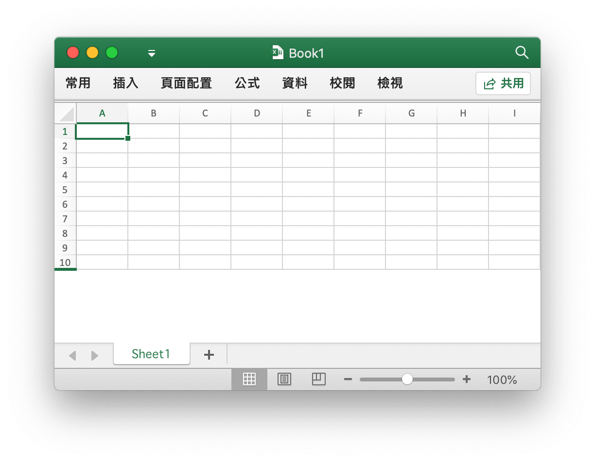
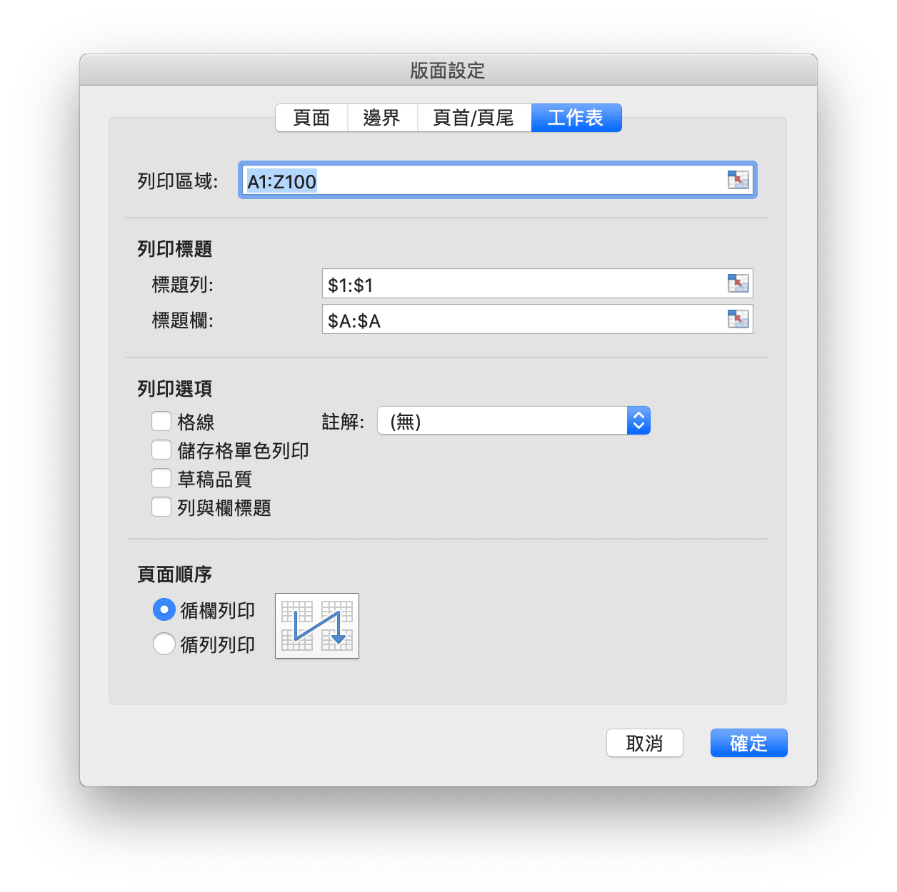

# 活頁簿

`Options` 定義了打開電子表格檔案的選項。

```go
type Options struct {
    Password          string
    RawCellValue      bool
    UnzipSizeLimit    int64
    UnzipXMLSizeLimit int64
}
```

`Password` 以明文形式指定打開活頁簿的密碼，默認值為空。

`RawCellValue` 用以指定讀取存儲格值時是否獲取原始值，默認值為 `false`（應用數字格式）。

`UnzipSizeLimit` 用以指定打開電子錶格檔案時的解壓縮大小限制（以位元組為單位），該值應大於或等於 `UnzipXMLSizeLimit`，默認大小限制為 16GB。

`UnzipXMLSizeLimit` 用以指定解壓每個工作表以及共享字符表時的內存限制（以位元組為單位），當大小超過此值時工作表 XML 文件將被解壓至系統臨時目錄，該值應小於或等於 `UnzipSizeLimit`，默認大小限制為 16MB。

## 創建 {#NewFile}

```go
func NewFile() *File
```

使用 `NewFile` 新建 Excel 工作薄，新創建的活頁簿中會默認包含一個名為 `Sheet1` 的工作表。

## 打開 {#OpenFile}

```go
func OpenFile(filename string, opt ...Options) (*File, error)
```

使用 `OpenFile` 打開已有 Excel 檔案。例如，打開帶有密碼保護的電子表格檔案：

```go
f, err := excelize.OpenFile("Book1.xlsx", excelize.Options{Password: "password"})
if err != nil {
    return
}
```

使用 [`Close()`](workbook.md#Close) 關閉已打開的活頁簿。

## 打開數據流 {#OpenReader}

```go
func OpenReader(r io.Reader, opt ...Options) (*File, error)
```

OpenReader 從 `io.Reader` 讀取數據流。

下面的例子中，我們創建一個簡單的 HTTP 服務器接收上傳的電子錶格檔案，向接收到的電子錶格檔案添加新工作表，並返回下載響應:

```go
package main

import (
    "fmt"
    "net/http"

    "github.com/xuri/excelize/v2"
)

func process(w http.ResponseWriter, req *http.Request) {
    file, _, err := req.FormFile("file")
    if err != nil {
        fmt.Fprintf(w, err.Error())
        return
    }
    defer file.Close()
    f, err := excelize.OpenReader(file)
    if err != nil {
        fmt.Fprintf(w, err.Error())
        return
    }
    f.NewSheet("NewSheet")
    w.Header().Set("Content-Disposition", "attachment; filename=Book1.xlsx")
    w.Header().Set("Content-Type", req.Header.Get("Content-Type"))
    if _, err := f.WriteTo(w); err != nil {
        fmt.Fprintf(w, err.Error())
    }
    return
}

func main() {
    http.HandleFunc("/process", process)
    http.ListenAndServe(":8090", nil)
}
```

使用 cURL 進行測試:

```bash
curl --location --request GET 'http://127.0.0.1:8090/process' \
--form 'file=@/tmp/template.xlsx' -O -J
curl: Saved to filename 'Book1.xlsx'
```

## 儲存 {#Save}

```go
func (f *File) Save() error
```

使用 `Save` 儲存對 Excel 檔案的編輯。

## 另存為 {#SaveAs}

```go
func (f *File) SaveAs(name string) error
```

使用 `SaveAs` 儲存 Excel 檔案為指定檔案。

## 關閉活頁簿 {#Close}

```go
func (f *File) Close() error
```

關閉活頁簿並清理打開檔案時可能產生的系統磁盤緩存。

## 新建工作表 {#NewSheet}

```go
func (f *File) NewSheet(name string) int
```

根據給定的工作表名稱來創建新工作表，並返回工作表在活頁簿中的索引。請注意，在創建新的活頁簿時，將包含名為 `Sheet1` 的默認工作表。

## 刪除工作表 {#DeleteSheet}

```go
func (f *File) DeleteSheet(name string)
```

根據給定的工作表名稱刪除指定工作表，謹慎使用此方法，這將會影響到與被刪除工作表相關聯的公式、引用、圖表等元素。如果有其他組件引用了被刪除工作表上的值，將會引發錯誤提示，甚至將會導致打開活頁簿失敗。當活頁簿中僅包含一個工作表時，調用此方法無效。

## 複製工作表 {#CopySheet}

```go
func (f *File) CopySheet(from, to int) error
```

根據給定的被複製工作表與目標工作表索引複製工作表，目標工作表索引需要開發者自行確認是否已經存在。目前支持僅包含儲存格值和公式的工作表間的複製，不支持包含表格、圖片、圖表和透視表等元素的工作表之間的複製。

```go
// 名稱為 Sheet1 的工作表已經存在 ...
index := f.NewSheet("Sheet2")
err := f.CopySheet(1, index)
return err
```

## 工作表分組 {#GroupSheets}

```go
func (f *File) GroupSheets(sheets []string) error
```

根據給定的工作表名稱對工作表進行分組，給定的工作表中需包含默認工作表。

## 取消工作表分組 {#UngroupSheets}

```go
func (f *File) UngroupSheets() error
```

取消工作表分組。

## 設定工作表背景圖片 {#SetSheetBackground}

```go
func (f *File) SetSheetBackground(sheet, picture string) error
```

根據給定的工作表名稱和圖片地址為指定的工作表設定平鋪效果的背景圖片。

## 設定默認工作表 {#SetActiveSheet}

```go
func (f *File) SetActiveSheet(index int)
```

根據給定的索引值設定默認工作表，索引的值應該大於等於 `0` 且小於活頁簿所包含的累積工作表總數。

## 獲取默認工作表索引 {#GetActiveSheetIndex}

```go
func (f *File) GetActiveSheetIndex() int
```

獲取默認工作表的索引，如果沒有找到默認工作表將傳回 `0`。

## 設定工作表可見性 {#SetSheetVisible}

```go
func (f *File) SetSheetVisible(name string, visible bool) error
```

根據給定的工作表名稱和可見性參數設定工作表的可見性。一個活頁簿中至少包含一個可見工作表。如果給定的工作表為默認工作表，則對其可見性設定無效。工作表可見性狀態可參考[工作表狀態枚舉](https://docs.microsoft.com/zh-cn/dotnet/api/documentformat.openxml.spreadsheet.sheetstatevalues?view=openxml-2.8.1):

|工作表狀態枚舉|
|---|
|visible|
|hidden|
|veryHidden|

例如，隱藏名為 `Sheet1` 的工作表:

```go
err := f.SetSheetVisible("Sheet1", false)
```

## 獲取工作表可見性 {#GetSheetVisible}

```go
func (f *File) GetSheetVisible(name string) bool
```

根據給定的工作表名稱獲取工作表可見性設定。例如，獲取名為 `Sheet1` 的工作表可見性設定:

```go
f.GetSheetVisible("Sheet1")
```

## 設定工作表格式屬性 {#SetSheetFormatPr}

```go
func (f *File) SetSheetFormatPr(sheet string, opts ...SheetFormatPrOptions) error
```

根據給定的工作表名稱設定格式屬性。

可選格式參數 | 數據類型
---|---
BaseColWidth | uint8
DefaultColWidth | float64
DefaultRowHeight | float64
CustomHeight | bool
ZeroHeight | bool
ThickTop | bool
ThickBottom | bool

例如，設定名為 `Sheet1` 的工作表中列默認為隱藏：

<p align="center"></p>

```go
f := excelize.NewFile()
const sheet = "Sheet1"
if err := f.SetSheetFormatPr("Sheet1", excelize.ZeroHeight(true)); err != nil {
    fmt.Println(err)
}
if err := f.SetRowVisible("Sheet1", 10, true); err != nil {
    fmt.Println(err)
}
f.SaveAs("Book1.xlsx")
```

## 獲取工作表格式屬性 {#GetSheetFormatPr}

```go
func (f *File) GetSheetFormatPr(sheet string, opts ...SheetFormatPrOptionsPtr) error
```

根據給定的工作表名稱獲取格式屬性。

可選格式參數 | 數據類型
---|---
BaseColWidth | uint8
DefaultColWidth | float64
DefaultRowHeight | float64
CustomHeight | bool
ZeroHeight | bool
ThickTop | bool
ThickBottom | bool

例子:

```go
f := excelize.NewFile()
const sheet = "Sheet1"

var (
    baseColWidth     excelize.BaseColWidth
    defaultColWidth  excelize.DefaultColWidth
    defaultRowHeight excelize.DefaultRowHeight
    customHeight     excelize.CustomHeight
    zeroHeight       excelize.ZeroHeight
    thickTop         excelize.ThickTop
    thickBottom      excelize.ThickBottom
)

if err := f.GetSheetFormatPr(sheet,
    &baseColWidth,
    &defaultColWidth,
    &defaultRowHeight,
    &customHeight,
    &zeroHeight,
    &thickTop,
    &thickBottom,
); err != nil {
    fmt.Println(err)
}
fmt.Println("Defaults:")
fmt.Println("- baseColWidth:", baseColWidth)
fmt.Println("- defaultColWidth:", defaultColWidth)
fmt.Println("- defaultRowHeight:", defaultRowHeight)
fmt.Println("- customHeight:", customHeight)
fmt.Println("- zeroHeight:", zeroHeight)
fmt.Println("- thickTop:", thickTop)
fmt.Println("- thickBottom:", thickBottom)
```

得到輸出：

```text
Defaults:
- baseColWidth: 0
- defaultColWidth: 0
- defaultRowHeight: 15
- customHeight: false
- zeroHeight: false
- thickTop: false
- thickBottom: false
```

## 設定工作表檢視屬性 {#SetSheetViewOptions}

```go
func (f *File) SetSheetViewOptions(name string, viewIndex int, opts ...SheetViewOption) error
```

根據給定的工作表名稱、檢視索引和檢視參數設定工作表檢視屬性，`viewIndex` 可以是負數，如果是這樣，則向後計數（`-1` 代表最後一個檢視）。

可選檢視參數|類別
---|---
DefaultGridColor | bool
ShowFormulas | bool
ShowGridLines | bool
ShowRowColHeaders | bool
ShowZeros | bool
RightToLeft | bool
ShowRuler | bool
View | string
TopLeftCell | string
ZoomScale | float64

- 例1:

```go
err = f.SetSheetViewOptions("Sheet1", -1, ShowGridLines(false))
```

- 例2:

```go
f := excelize.NewFile()
const sheet = "Sheet1"

if err := f.SetSheetViewOptions(sheet, 0,
    excelize.DefaultGridColor(false),
    excelize.ShowFormulas(true),
    excelize.ShowGridLines(true),
    excelize.ShowRowColHeaders(true),
    excelize.RightToLeft(false),
    excelize.ShowRuler(false),
    excelize.View("pageLayout"),
    excelize.TopLeftCell("C3"),
    excelize.ZoomScale(80),
); err != nil {
    fmt.Println(err)
}

var zoomScale ZoomScale
fmt.Println("Default:")
fmt.Println("- zoomScale: 80")

if err := f.SetSheetViewOptions(sheet, 0, excelize.ZoomScale(500)); err != nil {
    fmt.Println(err)
}

if err := f.GetSheetViewOptions(sheet, 0, &zoomScale); err != nil {
    fmt.Println(err)
}

fmt.Println("Used out of range value:")
fmt.Println("- zoomScale:", zoomScale)

if err := f.SetSheetViewOptions(sheet, 0, excelize.ZoomScale(123)); err != nil {
    fmt.Println(err)
}

if err := f.GetSheetViewOptions(sheet, 0, &zoomScale); err != nil {
    fmt.Println(err)
}

fmt.Println("Used correct value:")
fmt.Println("- zoomScale:", zoomScale)
```

得到輸出：

```text
Default:
- zoomScale: 80
Used out of range value:
- zoomScale: 80
Used correct value:
- zoomScale: 123
```

## 獲取工作表檢視屬性 {#GetSheetViewOptions}

```go
func (f *File) GetSheetViewOptions(name string, viewIndex int, opts ...SheetViewOptionPtr) error
```

根據給定的工作表名稱、檢視索引和檢視參數獲取工作表檢視屬性，`viewIndex` 可以是負數，如果是這樣，則向後計數（`-1` 代表最後一個檢視）。

可選檢視參數|類別
---|---
DefaultGridColor | bool
ShowFormulas | bool
ShowGridLines | bool
ShowRowColHeaders | bool
ShowZeros | bool
RightToLeft | bool
ShowRuler | bool
View | string
TopLeftCell | string
ZoomScale | float64

- 例1，獲取名為 `Sheet1` 的工作表上最後一個檢視的網格線屬性設定：

```go
var showGridLines excelize.ShowGridLines
err = f.GetSheetViewOptions("Sheet1", -1, &showGridLines)
```

- 例2：

```go
f := NewFile()
const sheet = "Sheet1"

var (
    defaultGridColor  excelize.DefaultGridColor
    showFormulas      excelize.ShowFormulas
    showGridLines     excelize.ShowGridLines
    showRowColHeaders excelize.ShowRowColHeaders
    showZeros         excelize.ShowZeros
    rightToLeft       excelize.RightToLeft
    showRuler         excelize.ShowRuler
    view              excelize.View
    topLeftCell       excelize.TopLeftCell
    zoomScale         excelize.ZoomScale
)

if err := f.GetSheetViewOptions(sheet, 0,
    &defaultGridColor,
    &showFormulas,
    &showGridLines,
    &showRowColHeaders,
    &showZeros,
    &rightToLeft,
    &showRuler,
    &view,
    &topLeftCell,
    &zoomScale,
); err != nil {
    fmt.Println(err)
}

fmt.Println("Default:")
fmt.Println("- defaultGridColor:", defaultGridColor)
fmt.Println("- showFormulas:", showFormulas)
fmt.Println("- showGridLines:", showGridLines)
fmt.Println("- showRowColHeaders:", showRowColHeaders)
fmt.Println("- showZeros:", showZeros)
fmt.Println("- rightToLeft:", rightToLeft)
fmt.Println("- showRuler:", showRuler)
fmt.Println("- view:", view)
fmt.Println("- topLeftCell:", `"`+topLeftCell+`"`)
fmt.Println("- zoomScale:", zoomScale)

if err := f.SetSheetViewOptions(sheet, 0, excelize.ShowGridLines(false)); err != nil {
    fmt.Println(err)
}

if err := f.GetSheetViewOptions(sheet, 0, &showGridLines); err != nil {
    fmt.Println(err)
}

if err := f.SetSheetViewOptions(sheet, 0, excelize.ShowZeros(false)); err != nil {
    fmt.Println(err)
}

if err := f.GetSheetViewOptions(sheet, 0, &showZeros); err != nil {
    fmt.Println(err)
}

if err := f.SetSheetViewOptions(sheet, 0, excelize.View("pageLayout")); err != nil {
    fmt.Println(err)
}

if err := f.GetSheetViewOptions(sheet, 0, &view); err != nil {
    fmt.Println(err)
}

if err := f.SetSheetViewOptions(sheet, 0, excelize.TopLeftCell("B2")); err != nil {
    fmt.Println(err)
}

if err := f.GetSheetViewOptions(sheet, 0, &topLeftCell); err != nil {
    fmt.Println(err)
}

fmt.Println("After change:")
fmt.Println("- showGridLines:", showGridLines)
fmt.Println("- showZeros:", showZeros)
fmt.Println("- view:", view)
fmt.Println("- topLeftCell:", topLeftCell)
```

得到輸出：

```text
Default:
- defaultGridColor: true
- showFormulas: false
- showGridLines: true
- showRowColHeaders: true
- showZeros: true
- rightToLeft: false
- showRuler: true
- view: normal
- topLeftCell: ""
- zoomScale: 0
After change:
- showGridLines: false
- showZeros: false
- view: pageLayout
- topLeftCell: B2
```

## 設定工作表頁面佈局 {#SetPageLayout}

```go
func (f *File) SetPageLayout(sheet string, opts ...PageLayoutOption) error
```

根據給定的工作表名稱和頁面佈局參數設定工作表的頁面佈局屬性。目前支持設定的頁面佈局屬性：

- 通過 `BlackAndWhite` 方法設定單色打印 `true` 或 `false`，默認值為 `false` 關閉。

- 通過 `FirstPageNumber` 方法設定頁面起始頁碼，默認為自動。

- 通過 `PageLayoutOrientation` 方法設定頁面佈局方向，默認頁面佈局方向為「縱向」。下面的表格是 Excelize 中頁面佈局方向 `PageLayoutOrientation` 參數的列表：

- 通過 `PageLayoutOrientation` 方法設定頁面佈局方向，默認頁面佈局方向為「直向」。下面的表格是 Excelize 中頁面佈局方向 `PageLayoutOrientation` 參數的列表：

參數 | 方向
---|---
OrientationPortrait | 直向
OrientationLandscape | 橫向

- 通過 `PageLayoutPaperSize` 方法設定頁面紙張大小，默認頁面佈局大小為「信紙 8½ × 11 英吋」。下面的表格是 Excelize 中頁面佈局大小和索引 `PageLayoutPaperSize` 參數的關係對照：

索引 | 紙張大小
---|---
1   | 信紙 8½ × 11 英吋
2   | 簡式信紙 8½ × 11 英吋
3   | 卡片 11 × 17 英吋
4   | 賬單 17 × 11 英吋
5   | 律師公文紙 8½ × 14 英吋
6   | 報告單 5½ × 8½ 英吋
7   | 行政公文紙 7½ × 10 英吋
8   | A3 297 × 420 毫米
9   | A4 210 × 297 毫米
10  | A4(小) 210 × 297 毫米
11  | A5 148 × 210 毫米
12  | B4 250 × 353 毫米
13  | B5 176 × 250 毫米
14  | 對開本 8½ × 13 英吋
15  | 四開 215 × 275 毫米
16  | 美式標準紙張 10 × 14 英吋
17  | 美式標準紙張 11 × 17 英吋
18  | 便簽 8.5 × 11 英吋
19  | 信封 #9 3.875 × 8.875 英吋
20  | 信封 #10 4⅛ × 9½ 英吋
21  | 信封 #11 4.5 × 10.375 英吋
22  | 信封 #12 4.75 × 11 英吋
23  | 信封 #14 5 × 11.5 英吋
24  | C paper 17 × 22 英吋
25  | D paper 22 × 34 英吋
26  | E paper 34 × 44 英吋
27  | 信封 DL 110 × 220 毫米
28  | 信封 C5 162 × 229 毫米
29  | 信封 C3 324 × 458 毫米
30  | 信封 C4 229 × 324 毫米
31  | 信封 C6 114 × 162 毫米
32  | 信封 C65 114 × 229 毫米
33  | 信封 B4 250 × 353 毫米
34  | 信封 B5 176 × 250 毫米
35  | 信封 B6 176 × 125 毫米
36  | 信封 Italy 110 × 230 毫米
37  | 君主式信封 3.88 × 7.5 英吋
38  | 6¾ 信封 3.625 × 6.5 英吋
39  | 美國標準 fanfold 14.875 × 11 英吋
40  | 德國標準 fanfold 8.5 × 12 英吋
41  | 德國法律專用紙 fanfold 8.5 × 13 英吋
42  | ISO B4 250 × 353 毫米
43  | 日式明信片 100 × 148 毫米
44  | Standard paper 9 × 11 英吋
45  | Standard paper 10 × 11 英吋
46  | Standard paper 15 × 11 英吋
47  | 邀請信 220 × 220 毫米
50  | 信紙加大 9.275 × 12 英吋
51  | 特大法律專用紙 9.275 × 15 英吋
52  | Tabloid extra paper 11.69 × 18 英吋
53  | A4 特大 236 × 322 毫米
54  | 信紙橫向旋轉 8.275 × 11 英吋
55  | A4 橫向旋轉 210 × 297 毫米
56  | 信紙特大橫向旋轉 9.275 × 12 英吋
57  | SuperA/SuperA/A4 paper 227 × 356 毫米
58  | SuperB/SuperB/A3 paper 305 × 487 毫米
59  | 信紙加大 8.5 × 12.69 英吋
60  | A4 加大 210 × 330 毫米
61  | A5 橫向旋轉 148 × 210 毫米
62  | JIS B5 橫向旋轉 182 × 257 毫米
63  | A3 特大 322 × 445 毫米
64  | A5 特大 174 × 235 毫米
65  | ISO B5 特大 201 × 276 毫米
66  | A2 420 × 594 毫米
67  | A3 橫向旋轉 297 × 420 毫米
68  | A3 特大橫向旋轉 322 × 445 毫米
69  | 雙層日式明信片 200 × 148 毫米
70  | A6 105 × 148 毫米
71  | 日式信封 Kaku #2
72  | 日式信封 Kaku #3
73  | 日式信封 Chou #3
74  | 日式信封 Chou #4
75  | 信紙橫向旋轉 11 × 8½ 英吋
76  | A3 橫向旋轉 420 × 297 毫米
77  | A4 橫向旋轉 297 × 210 毫米
78  | A5 橫向旋轉 210 × 148 毫米
79  | B4 (JIS) 橫向旋轉 364 × 257 毫米
80  | B5 (JIS) 橫向旋轉 257 × 182 毫米
81  | 日式明信片 橫向旋轉 148 × 100 毫米
82  | 雙層日式明信片 橫向旋轉 148 × 200 毫米
83  | A6 橫向旋轉 148 × 105 毫米
84  | 日式信封 Kaku #2 橫向旋轉
85  | 日式信封 Kaku #3 橫向旋轉
86  | 日式信封 Chou #3 橫向旋轉
87  | 日式信封 Chou #4 橫向旋轉
88  | B6 (JIS) 128 × 182 毫米
89  | B6 (JIS) 橫向旋轉 182 × 128 毫米
90  | 12 × 11 英吋
91  | 日式信封 You #4
92  | 日式信封 You #4 橫向旋轉
93  | 中式 16 開 146 × 215 毫米
94  | 中式 32 開 97 × 151 毫米
95  | 中式大 32 開 97 × 151 毫米
96  | 中式信封 #1 102 × 165 毫米
97  | 中式信封 #2 102 × 176 毫米
98  | 中式信封 #3 125 × 176 毫米
99  | 中式信封 #4 110 × 208 毫米
100 | 中式信封 #5 110 × 220 毫米
101 | 中式信封 #6 120 × 230 毫米
102 | 中式信封 #7 160 × 230 毫米
103 | 中式信封 #8 120 × 309 毫米
104 | 中式信封 #9 229 × 324 毫米
105 | 中式信封 #10 324 × 458 毫米
106 | 中式 16 開 橫向旋轉
107 | 中式 32 開 橫向旋轉
108 | 中式大 32 開 橫向旋轉
109 | 中式信封 #1 橫向旋轉 165 × 102 毫米
110 | 中式信封 #2 橫向旋轉 176 × 102 毫米
111 | 中式信封 #3 橫向旋轉 176 × 125 毫米
112 | 中式信封 #4 橫向旋轉 208 × 110 毫米
113 | 中式信封 #5 橫向旋轉 220 × 110 毫米
114 | 中式信封 #6 橫向旋轉 230 × 120 毫米
115 | 中式信封 #7 橫向旋轉 230 × 160 毫米
116 | 中式信封 #8 橫向旋轉 309 × 120 毫米
117 | 中式信封 #9 橫向旋轉 324 × 229 毫米
118 | 中式信封 #10 橫向旋轉 458 × 324 毫米

- 通過 `FitToHeight` 方法設定頁面縮放調整頁寬，默認值為 `1`。

- 通過 `FitToWidth` 方法設定頁面縮放調整頁高，默認值為 `1`。

- 通過 `PageLayoutScale` 方法設定頁面縮放比例，取值範圍 10 至 400，即縮放 10% 至 400%，默認值為 `100` 正常尺寸。

- 例如，將名為 `Sheet1` 的工作表頁面佈局設定為單色打印、起始頁碼為 `2`、橫向、使用 A4(小) 210 × 297 毫米紙張、調整為 2 頁寬、2 頁高並縮放 50%：

```go
f := excelize.NewFile()
if err := f.SetPageLayout(
    "Sheet1",
    excelize.BlackAndWhite(true),
    excelize.FirstPageNumber(2),
    excelize.PageLayoutOrientation(excelize.OrientationLandscape),
    excelize.PageLayoutPaperSize(10),
    excelize.FitToHeight(2),
    excelize.FitToWidth(2),
    excelize.PageLayoutScale(50),
); err != nil {
    fmt.Println(err)
}
```

## 獲取工作表頁面佈局 {#GetPageLayout}

```go
func (f *File) GetPageLayout(sheet string, opts ...PageLayoutOptionPtr) error
```

根據給定的工作表名稱和頁面佈局參數獲取工作表的頁面佈局屬性。

- 通過 `PageLayoutOrientation` 方法獲取頁面佈局方向
- 通過 `PageLayoutPaperSize` 方法獲取頁面紙張大小

例如，獲取名為 `Sheet1` 的工作表頁面佈局設定：

```go
f := excelize.NewFile()
const sheet = "Sheet1"
var (
    orientation excelize.PageLayoutOrientation
    paperSize   excelize.PageLayoutPaperSize
)
if err := f.GetPageLayout("Sheet1", &orientation); err != nil {
    fmt.Println(err)
}
if err := f.GetPageLayout("Sheet1", &paperSize); err != nil {
    fmt.Println(err)
}
fmt.Println("Defaults:")
fmt.Printf("- orientation: %q\n", orientation)
fmt.Printf("- paper size: %d\n", paperSize)
```

得到輸出：

```text
Defaults:
- orientation: "portrait"
- paper size: 1
```

## 設定工作表頁邊距 {#SetPageMargins}

```go
func (f *File) SetPageMargins(sheet string, opts ...PageMarginsOptions) error
```

根據給定的工作表名稱和頁邊距參數設定工作表的頁邊距。頁邊距可選參數：

參數|資料類別
---|---
PageMarginBotom|float64
PageMarginFooter|float64
PageMarginHeader|float64
PageMarginLeft|float64
PageMarginRight|float64
PageMarginTop|float64

- 例如，設定名為 `Sheet1` 的工作表頁邊距:

```go
f := excelize.NewFile()
const sheet = "Sheet1"

if err := f.SetPageMargins(sheet,
    excelize.PageMarginBottom(1.0),
    excelize.PageMarginFooter(1.0),
    excelize.PageMarginHeader(1.0),
    excelize.PageMarginLeft(1.0),
    excelize.PageMarginRight(1.0),
    excelize.PageMarginTop(1.0),
); err != nil {
    fmt.Println(err)
}
```

## 獲取工作表頁邊距 {#GetPageMargins}

```go
func (f *File) GetPageMargins(sheet string, opts ...PageMarginsOptionsPtr) error
```

根據給定的工作表名稱和頁邊距參數獲取工作表的頁邊距。頁邊距可選參數：

參數|資料類別
---|---
PageMarginBotom|float64
PageMarginFooter|float64
PageMarginHeader|float64
PageMarginLeft|float64
PageMarginRight|float64
PageMarginTop|float64

- 例如，獲取名為 `Sheet1` 的工作表頁邊距:

```go
f := excelize.NewFile()
const sheet = "Sheet1"

var (
    marginBottom excelize.PageMarginBottom
    marginFooter excelize.PageMarginFooter
    marginHeader excelize.PageMarginHeader
    marginLeft   excelize.PageMarginLeft
    marginRight  excelize.PageMarginRight
    marginTop    excelize.PageMarginTop
)

if err := f.GetPageMargins(sheet,
    &marginBottom,
    &marginFooter,
    &marginHeader,
    &marginLeft,
    &marginRight,
    &marginTop,
); err != nil {
    fmt.Println(err)
}
fmt.Println("Defaults:")
fmt.Println("- marginBottom:", marginBottom)
fmt.Println("- marginFooter:", marginFooter)
fmt.Println("- marginHeader:", marginHeader)
fmt.Println("- marginLeft:", marginLeft)
fmt.Println("- marginRight:", marginRight)
fmt.Println("- marginTop:", marginTop)
```

得到輸出：

```text
Defaults:
- marginBottom: 0.75
- marginFooter: 0.3
- marginHeader: 0.3
- marginLeft: 0.7
- marginRight: 0.7
- marginTop: 0.75
```

## 設定活頁簿屬性 {#SetWorkbookPrOptions}

```go
func (f *File) SetWorkbookPrOptions(opts ...WorkbookPrOption) error
```

SetWorkbookPrOptions 用於設定活頁簿的屬性。可選參數：

參數|資料類別
---|---
Date1904|bool
FilterPrivacy|bool
CodeName|string

- 例如，設定活頁簿屬性:

```go
f := excelize.NewFile()
if err := f.SetWorkbookPrOptions(
    excelize.Date1904(false),
    excelize.FilterPrivacy(false),
    excelize.CodeName("code"),
); err != nil {
    fmt.Println(err)
}
```

## 獲取活頁簿屬性 {#GetWorkbookPrOptions}

```go
func (f *File) GetWorkbookPrOptions(opts ...WorkbookPrOptionPtr) error
```

GetWorkbookPrOptions 用於獲取活頁簿的屬性。可選參數：

參數|資料類別
---|---
Date1904|bool
FilterPrivacy|bool
CodeName|string

- 例如，獲取活頁簿屬性:

```go
f := excelize.NewFile()
var (
    date1904      excelize.Date1904
    filterPrivacy excelize.FilterPrivacy
    codeName      excelize.CodeName
)
if err := f.GetWorkbookPrOptions(&date1904); err != nil {
    fmt.Println(err)
}
if err := f.GetWorkbookPrOptions(&filterPrivacy); err != nil {
    fmt.Println(err)
}
if err := f.GetWorkbookPrOptions(&codeName); err != nil {
    fmt.Println(err)
}
fmt.Println("Defaults:")
fmt.Printf("- date1904: %t\n", date1904)
fmt.Printf("- filterPrivacy: %t\n", filterPrivacy)
fmt.Printf("- codeName: %q\n", codeName)
```

得到輸出：

```text
Defaults:
- filterPrivacy: true
- codeName: ""
```

## 設定頁眉和頁腳 {#SetHeaderFooter}

```go
func (f *File) SetHeaderFooter(sheet string, settings *FormatHeaderFooter) error
```

根據給定的工作表名稱和控制字符設定工作表的頁眉和頁腳。

頁眉和頁腳包含如下欄位：

欄位           | 描述
---|---
AlignWithMargins | 設定頁眉頁腳頁邊距與頁邊距對齊
DifferentFirst   | 設定第一頁頁眉和頁腳
DifferentOddEven | 設定奇數和偶數頁頁眉和頁腳
ScaleWithDoc     | 設定頁眉和頁腳跟隨檔案縮放
OddFooter        | 奇數頁頁腳控制字符
OddHeader        | 奇數頁頁眉控制字符
EvenFooter       | 偶數頁頁腳控制字符
EvenHeader       | 偶數頁頁眉控制字符
FirstFooter      | 首頁頁腳控制字符
FirstHeader      | 首頁頁眉控制字符

下表中的格式代碼可用於 6 個字符串類別欄位: `OddHeader`, `OddFooter`, `EvenHeader`, `EvenFooter`, `FirstFooter`, `FirstHeader`

<table>
    <thead>
        <tr>
            <th>格式代碼</th>
            <th>描述</th>
        </tr>
    </thead>
    <tbody>
        <tr>
            <td><code>&amp;&amp;</code></td>
            <td>字符 &quot;&amp;&quot;</td>
        </tr>
        <tr>
            <td><code>&amp;font-size</code></td>
            <td>文本字型的大小, 其中字型大小為以磅為單位的十進制字型大小</td>
        </tr>
        <tr>
            <td><code>&amp;&quot;font name,font type&quot;</code></td>
            <td>文本字型名字符串、字型名稱和文本字型類別字符串、字型類別</td>
        </tr>
        <tr>
            <td><code>&amp;&quot;-,Regular&quot;</code></td>
            <td>常規文本格式。關閉粗體和斜體模式</td>
        </tr>
        <tr>
            <td><code>&amp;A</code></td>
            <td>當前工作表名稱</td>
        </tr>
        <tr>
            <td><code>&amp;B</code> or <code>&amp;&quot;-,Bold&quot;</code></td>
            <td>粗體文本格式, 關閉或打開，默認關閉。</td>
        </tr>
        <tr>
            <td><code>&amp;D</code></td>
            <td>當前日期</td>
        </tr>
        <tr>
            <td><code>&amp;C</code></td>
            <td>中間部分</td>
        </tr>
        <tr>
            <td><code>&amp;E</code></td>
            <td>對文本使用雙下划線</td>
        </tr>
        <tr>
            <td><code>&amp;F</code></td>
            <td>當前活頁簿檔案名稱</td>
        </tr>
        <tr>
            <td><code>&amp;G</code></td>
            <td>將指定對象做為背景（暫不支持）</td>
        </tr>
        <tr>
            <td><code>&amp;H</code></td>
            <td>文字陰影</td>
        </tr>
        <tr>
            <td><code>&amp;I</code> or <code>&amp;&quot;-,Italic&quot;</code></td>
            <td>文字傾斜</td>
        </tr>
        <tr>
            <td><code>&amp;K</code></td>
            <td>字型色彩<br>格式為 RRGGBB 的 RGB 色彩<br>主題色彩被指定為 TTSNNN, 其中 TT 是主題色彩 id, S 是色調或陰影的 &quot;+&quot; 或者 &quot;-&quot;, 是色調或陰影的值</td>
        </tr>
        <tr>
            <td><code>&amp;L</code></td>
            <td>左側部分</td>
        </tr>
        <tr>
            <td><code>&amp;N</code></td>
            <td>總頁數</td>
        </tr>
        <tr>
            <td><code>&amp;O</code></td>
            <td>大綱文本格式</td>
        </tr>
        <tr>
            <td><code>&amp;P[[+\|-]n]</code></td>
            <td>如果沒有可選的後綴, 當前頁碼 (十進制)</td>
        </tr>
        <tr>
            <td><code>&amp;R</code></td>
            <td>右側部分</td>
        </tr>
        <tr>
            <td><code>&amp;S</code></td>
            <td>文本刪除線</td>
        </tr>
        <tr>
            <td><code>&amp;T</code></td>
            <td>當前時間</td>
        </tr>
        <tr>
            <td><code>&amp;U</code></td>
            <td>為文本添加單下划線。默認模式處於關閉狀態</td>
        </tr>
        <tr>
            <td><code>&amp;X</code></td>
            <td>上標格式</td>
        </tr>
        <tr>
            <td><code>&amp;Y</code></td>
            <td>下標格式</td>
        </tr>
        <tr>
            <td><code>&amp;Z</code></td>
            <td>當前活頁簿檔案路徑</td>
        </tr>
    </tbody>
</table>

例如：

```go
err := f.SetHeaderFooter("Sheet1", &excelize.FormatHeaderFooter{
    DifferentFirst:   true,
    DifferentOddEven: true,
    OddHeader:        "&R&P",
    OddFooter:        "&C&F",
    EvenHeader:       "&L&P",
    EvenFooter:       "&L&D&R&T",
    FirstHeader:      `&CCenter &"-,Bold"Bold&"-,Regular"HeaderU+000A&D`,
})
```

上面的例子蘊含如下格式：

- 第一頁有自己的頁眉和頁腳
- 奇數和偶數頁具有不同的頁眉和頁腳
- 奇數頁標題右側部分為當前頁碼
- 奇數頁頁腳中心部分為當前活頁簿的檔案名
- 偶數頁標題左側部分為當前頁碼
- 左側部分為當前日期，偶數頁頁腳右側部分為當前時間
- 第一頁中心部分的第一行上的文本為「Center Bold Header」, 第二行為日期
- 第一頁上沒有頁腳

## 設定名稱 {#SetDefinedName}

```go
func (f *File) SetDefinedName(definedName *DefinedName) error
```

根據給定的名稱和引用區域設定名稱，默認範圍是活頁簿。例如：

```go
f.SetDefinedName(&excelize.DefinedName{
    Name:     "Amount",
    RefersTo: "Sheet1!$A$2:$D$5",
    Comment:  "defined name comment",
    Scope:    "Sheet2",
})
```

工作表的列印區域和列印標題设定:

<p align="center"></p>

```go
f.SetDefinedName(&excelize.DefinedName{
    Name:     "_xlnm.Print_Area",
    RefersTo: "Sheet1!$A$1:$Z$100",
    Scope:    "Sheet1",
})
f.SetDefinedName(&excelize.DefinedName{
    Name:     "_xlnm.Print_Titles",
    RefersTo: "Sheet1!$A:$A,Sheet1!$1:$1",
    Scope:    "Sheet1",
})
```

## 獲取名稱 {#GetDefinedName}

```go
func (f *File) GetDefinedName() []DefinedName
```

獲取作用範圍內的活頁簿和工作表的名稱列表。

## 刪除名稱 {#DeleteDefinedName}

```go
func (f *File) DeleteDefinedName(definedName *DefinedName) error
```

根據給定的名稱和名稱作用範圍刪除已定義的名稱，默認名稱的作用範圍為活頁簿。例如：

```go
f.DeleteDefinedName(&excelize.DefinedName{
    Name:     "Amount",
    Scope:    "Sheet2",
})
```

## 設定活頁簿應用程式屬性 {#SetAppProps}

```go
func (f *File) SetAppProps(appProperties *AppProperties) error
```

設定活頁簿的應用程式屬性。可以設定的屬性包括:

屬性           | 描述
---|---
Application       | 創建此檔案的應用程式的名稱
ScaleCrop         | 指定檔案縮略圖的顯示方式。設定為 `true` 指定將檔案縮略圖縮放顯示，設定為 `false` 指定將檔案縮略圖剪裁顯示
DocSecurity       | 以數值表示的檔案安全級別。檔案安全定義為: <br>1 - 檔案受密碼保護<br>2 - 建議以只讀方式打開檔案<br>3 - 強制以只讀方式打開檔案<br>4 - 檔案批注被鎖定
Company           | 與檔案關聯的公司的名稱
LinksUpToDate     | 設定檔案中的超鏈接是否是最新的。設定為 `true` 表示超鏈接已更新，設定為 `false` 表示超鏈接已過時
HyperlinksChanged | 指定下一次打開此檔案時是否應使用本部分中指定的新超鏈接更新超鏈接關係
AppVersion        | 指定生成此檔案的應用程式的版本。值應為 XX.YYYY 格式，其中 X 和 Y 代表數值，否則文件將不符合標準

例如：

```go
err := f.SetAppProps(&excelize.AppProperties{
    Application:       "Microsoft Excel",
    ScaleCrop:         true,
    DocSecurity:       3,
    Company:           "Company Name",
    LinksUpToDate:     true,
    HyperlinksChanged: true,
    AppVersion:        "16.0000",
})
```

## 獲取活頁簿應用程式屬性 {#GetAppProps}

```go
func (f *File) GetAppProps() (*AppProperties, error)
```

獲取活頁簿的應用程式屬性。

## 設定檔案屬性 {#SetDocProps}

```go
func (f *File) SetDocProps(docProperties *DocProperties) error
```

設定活頁簿的核心屬性。可以設定的屬性包括:

屬性           | 描述
---|---
Category       | 檔案內容的分類
ContentStatus  | 檔案內容的狀態。例如: 值可能包括 "Draft"、"Reviewed" 和 "Final"
Created        | 檔案創建時間
Creator        | 創作者
Description    | 資源內容的說明
Identifier     | 對給定上下文中的資源的明確引用
Keywords       | 檔案關鍵詞
Language       | 檔案內容的主要語言
LastModifiedBy | 執行上次修改的用戶
Modified       | 檔案修改時間
Revision       | 檔案修訂版本
Subject        | 檔案主題
Title          | 檔案標題
Version        | 版本號，該值由用戶或應用程式設定

例如：

```go
err := f.SetDocProps(&excelize.DocProperties{
    Category:       "category",
    ContentStatus:  "Draft",
    Created:        "2019-06-04T22:00:10Z",
    Creator:        "Go Excelize",
    Description:    "This file created by Go Excelize",
    Identifier:     "xlsx",
    Keywords:       "Spreadsheet",
    LastModifiedBy: "Go Author",
    Modified:       "2019-06-04T22:00:10Z",
    Revision:       "0",
    Subject:        "Test Subject",
    Title:          "Test Title",
    Language:       "en-US",
    Version:        "1.0.0",
})
```

## 獲取檔案屬性 {#GetDocProps}

```go
func (f *File) GetDocProps() (*DocProperties, error)
```

獲取活頁簿的核心屬性。
